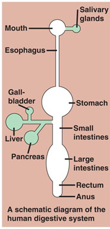
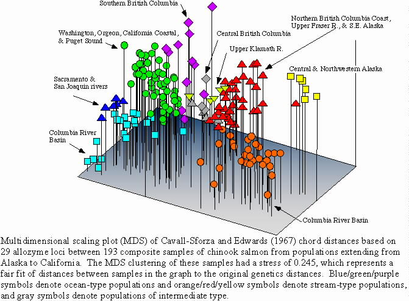
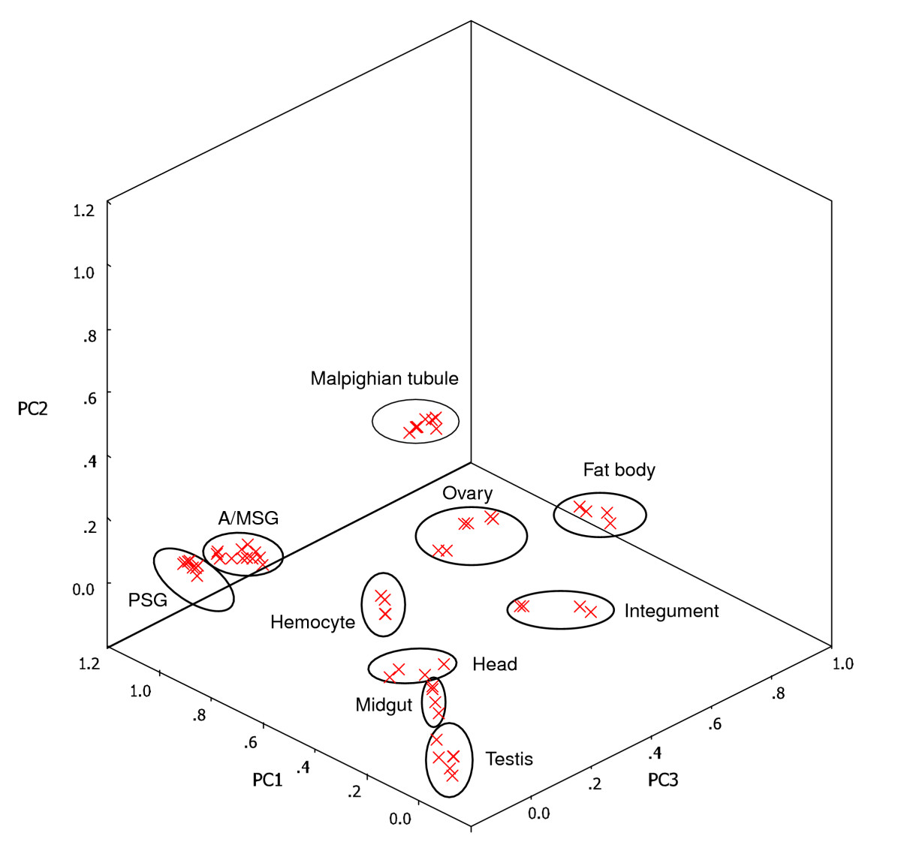
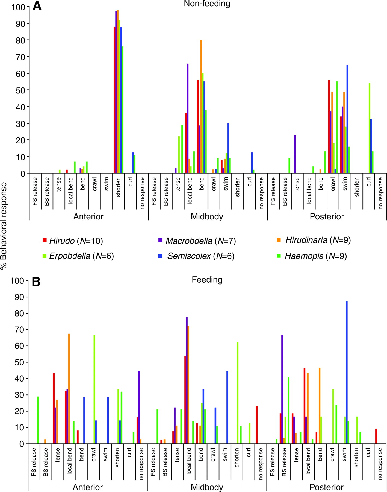
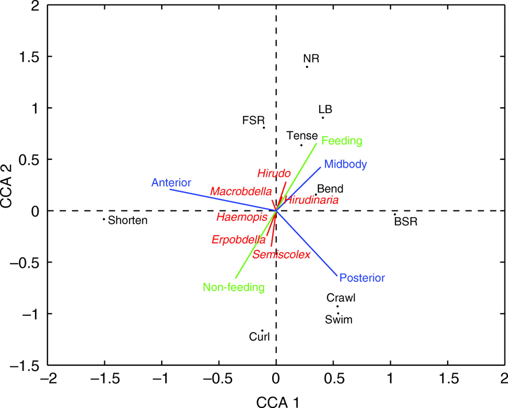
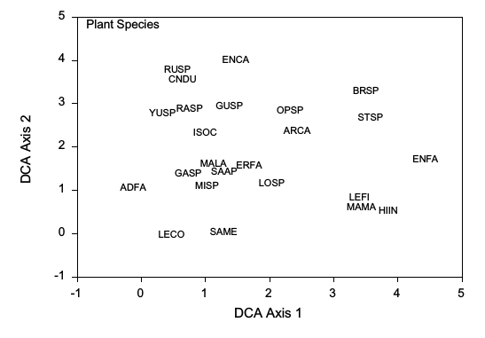
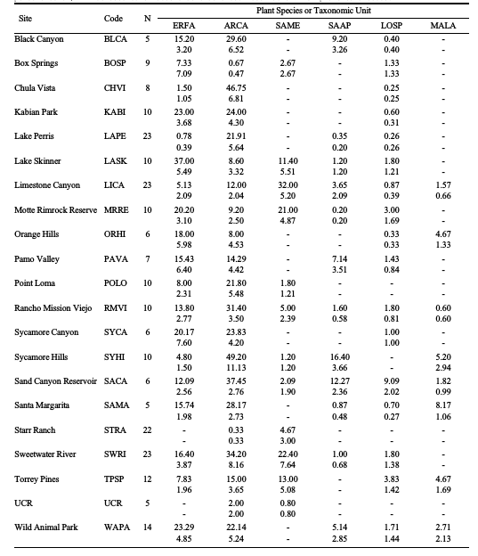
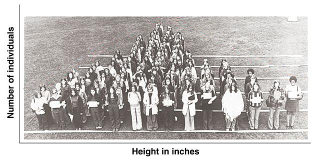
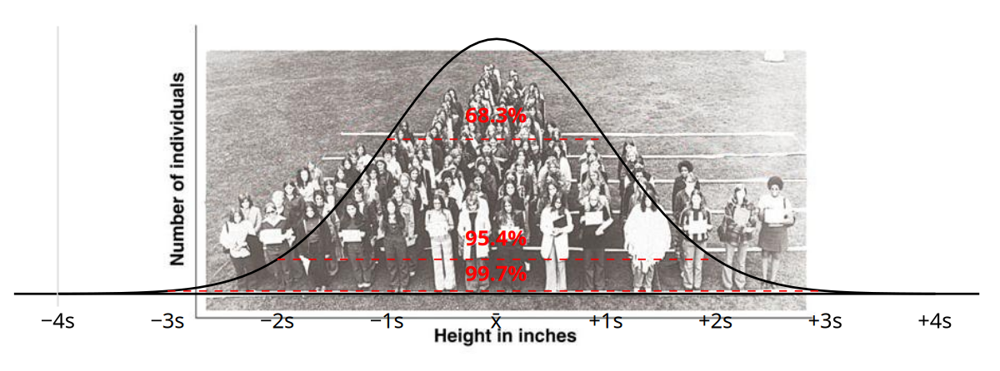



# Multivariate data

- Univariate = one response variable
  - In Biol 215 all analyses (simple linear regression, ANOVA) have one predictor and one response
  - In Biol 531 we cover multiple regression, factorial ANOVA’s which have more than one predictor but only one response
- Multivariate = two or more response variables
  - May have no predictors, one predictor, or many predictors

# Why multivariate, and why now?

- Multivariate analysis for multivariate questions
  - Whole-animal studies
  - Genome-wide studies
- Survival skills
  - Scientific literacy
  - Your own studies
- Computers have made it possible to use these techniques

## Systems thinking

:::::: columns
::: {.column width="60%"}
- Systems are composed of components
- Components have properties
- Components affect others
- Use variables to characterize properties of components
:::

::: {.column width="40%"}
{fig-align="center"}
:::

::: {.column width="100%"}
- Statistical analysis to measure interactions between components
:::
::::::

## When one variable isn't enough

- Multiple variables respond
  - Component properties (multiple properties)
  - Gene expression (multiple genes)
  - Behavioral repertoire (multiple behaviors)
  - Ecological communities (multiple species)
  - Soil nutrients (multiple nutrients)
- One variable at a time risks missing:
  - Consistent patterns across multiple variables
  - Exceptions to the general rule

## Genetics of Chinook salmon runs

::::: columns
::: {.column width="35%"}
Which salmon runs are genetically distinct?

No single gene can answer as well as multiple genes can
:::

::: {.column width="65%"}
{fig-align="center" width="100%"}
:::
:::::

## Silkworm gene expression

::::: columns
::: {.column width="50%"}
From Xia et al. 2007

Expression of 7,700 genes sampled from various tissues in silkworms
:::

::: {.column width="50%"}
{width="100%"}
:::
:::::

## Leech response to stimulus

::::: columns
::: {.column width="35%"}
From Gaudry et al. 2010

Compare responses when feeding or not

A whole suite of behaviors possible, how does the repertoire change?
:::

::: {.column width="65%"}
{.lightbox style="float:left; margin-right:10px" width="40%"} {.lightbox style="float:left" width="40%"}
:::
:::::

## Plants in So. California CSS

::::: columns
::: {.column width="50%"}
*From Rotenberry et al. 2001*

{fig-align="center"}
:::

::: {.column width="50%"}

:::
:::::

# Computing power

- Computers have gotten wildly more powerful in the last few decades

- Today's desktop computers are more powerful than yesterday's supercomputers

- This is a quantitative change, but it has greatly expanded what we can do with computers

## Quantitative becomes qualitative

- Powerful computers make multivariate analysis practical

- Example: inversion of a covariance matrix by hand

  - 5 variables → 5 x 5 covariance matrix
  - 5 x 5 matrix took many hours
  - 12 x 12 matrix took a week or two
  - 24 x 24 matrix estimated to require a couple hundred years

- Computers invert matrices of these sizes so fast you can't see it happening

## Example: inverting a 24x24 covariance matrix

```{webr}

sapply(1:24, FUN = function(x) rnorm(100,10,2)) -> variables

var(variables) -> variables.cov

solve(variables.cov)
```

# Interpreting the literature

- Sophisticated statistics, including multivariate statistics, have become common

- If it's not explained you're expected to know → sophistication is expected now

- How do you interpret results of multivariate analysis?

## What is being used, and why?

:::::: columns
::: {.column width="75%"}
- Fashion or necessity?
- Problems techniques solve, problems they cause?
- Design fixes vs. analytical fixes?
- Alternative approaches vs. distinct methods?
:::

::: {.column width="5%"}
:::

::: {.column width="20%"}
[*A 3D object in 2D*]{style="font-size:0.5em"}

{fig-align="center" height="150"}

{fig-align="center" height="150"}
:::
::::::

# Review of some essentials

- [Random variables]{style="color: red"}
- Null hypothesis testing
- Statistical errors, statistical power

## Random variables

::::: columns
::: {.column width="50%"}
- **Random variables** do not have a single value
- Biological systems are made up primarily of random variables
:::

::: {.column width="50%"}
{fig-align="center"}
:::
:::::

- Example: height of women in the USA
  - “Women in the U.S.A. are 5' 6" tall" doesn't mean all of them are
  - 5' 6" is the mean, but individuals vary
  - How do we understand a variable like height? Summarize it

## Summarizing data

- **Summary statistic** = a value calculated from data that measures a characteristic of the data set
  - Summary statistics can be consistent, predictable even if individual values are not
- Central tendency = the middle of data, typical value, “expected value”
  - Mean, median, mode
- Dispersion = amount of variation in the data
  - Standard deviation, variance, interquartile range

## Distribution of heights

{fig-align="center"}

[The percentage of observations that fall within 1s, 2s, and 3s on a normal distribution are predictable - 1s = 68%, 2s = 95%, 3s = 99%]{.asides}

# Review of some essentials

- Random variables
- [Null hypothesis testing]{style="color: red"}
- Statistical errors, statistical power

## Inferential statistics

- Experimental data is expected to generalize
  - Mice in the lab expected to represent mice in general
  - That is, we work with samples to learn about populations
- Inference = a conclusion about a **population** based on information in a **sample** drawn from it
- Statistical methods for making inferences = **inferential statistics**
- Summary statistics are also sample **estimates** of population **parameters**

## Estimates and parameters

::: {style="font-size:0.8em"}
| Statistic          | Sample estimate | Population parater |
|--------------------|:---------------:|:------------------:|
| Arithmetic mean    |        x̄        |         μ          |
| Standard deviation |        s        |         σ          |
| Variance           |      s^2^       |        σ^2^        |

: *Summary statistics are also estimates of population parameters*
:::

- Sample estimates known - calculated from the data

- Population parameters unknown - test hypotheses about them using sample data

## Testing μ = 37°C

- Normal human body temperature is 37°C
- Take temperatures for the class (our sample), find x̄ = 36.9°C
- Are we wrong about the value of μ?

## Problem: random sampling

- Remember: random variables

- Two things that can both be true at the same time:

  :::::: columns
  ::: {.column width="65%"}
  ***Thing 1:** The mean body temperature of the population, μ, is exactly 37°C*

  ***Thing 2:** The mean of any sample of people from the population, x̄, will be at least a little different from μ due to random sampling*
  :::

  ::: {.column width="5%"}
  :::

  ::: {.column width="30%"}
  <iframe src="https://wkristan.github.io/apps/one_sample_body_temp/onesample_body_temp.html" style="width:350px; height:475px;" data-external="1">

  </iframe>
  :::
  ::::::

## The logic of the test

- Null hypothesis = the hypothesized value of μ
  - H~O~: μ = 37°C, or H~O~: μ - 37 = 0
- The test asks: “is the sample mean more different from the population mean than expected by random chance ***assuming the null hypothesis is true***”
- How much difference from 37°C is typical of random chance?

## Random sampling variation when μ = 37°C

- We can simulate...
  - Select a sample from a population with mean of μ = 37°C
  - Calculate the mean of the sample
  - Repeat many times
- This will show us how much variation to expect when the null is true

##  {.centered-bg data-background-iframe="https://wkristan.github.io/apps/sampling_app/sampling_distributions_onesample.html" background-interactive="true" data-external="1"}

## p-values

- Use t-distribution as the **sampling distribution**
  - *Distribution of means drawn at random from a population*
- Calculate an observed t-value as $t_{obs} = \frac{\bar{x}-\mu}{s_\bar{x}}$
  - *Converts difference to standard error units, t*
  - $s_{\bar x}$ is standard error, dispersion of sampling distribution, equal to $\frac {s}{\sqrt n}$
- p-value = probability the mean of a random sample will be more different from μ than the $\bar x$ we observed

##  {.centered-bg data-background-iframe="https://wkristan.github.io/apps/one_two_tails/one_two_tail_testing.html" background-interactive="true" data-external="1"}

## One-sample t-tests are nearly the same as 95% confidence intervals {.smaller}

:::::: columns
::: {.column width="45%"}
*One-sample t-test*

- Interval centered on μ
- x-axis is t units = number of standard errors from μ
- Question is: does x̄ fall inside the interval around μ?
:::

::: {.column width="10%"}
:::

::: {.column width="45%"}
*Sample mean with 95% CI*

- Interval centered on x̄
- Equal to x̄ ± t s~x̄~
- Units are same as data, t s~x̄~ does the unit conversion
- Question is: does μ fall inside the interval around x̄?
:::
::::::

##  {.centered-bg data-background-iframe="https://wkristan.github.io/apps/conf_int/confidence_intervals.html" background-interactive="true" data-external="1"}

## Three types of t-tests

- One-sample

- Independent samples

- Paired samples

##  {.centered-bg-bigger data-background-iframe="https://wkristan.github.io/apps/ttest/ttest_types.html" background-interactive="true" data-external="1"}

# Review of some essentials

- Random variables
- Null hypothesis testing
- [Statistical errors, statistical power]{style="color:red"}

## Errors in hypothesis tests

::: r-frame
|  |  |  |
|-------------------------|-----------------------|-------------------------|
|  | Null true | Null false |
| Test positive | [Type I error]{style="color:orange"} | *No error* |
| Test negative | *No error* | [Type II error]{style="color:orange"} |

: *Which error depends on whether H~0~ is true*
:::

- We pick Type I error rate = α
- We don't pick Type II error rate (β), but can affect how big it is

## Statistical errors and power

<iframe src="https://wkristan.github.io/apps/error_power/error_power_plotly.html" data-external="1" style="width: 100%; height: 100%">

</iframe>

# Wrap up

- We work with material that varies, and statistics provides us with a conceptual framework for understanding it

  - Random variables, central tendency and dispersion

  - Hypothesis testing - separating real from random effects

- Three forms of t-test, appropriate for different experimental designs

- Some uncertainty is unavoidable - statistical errors

- Detection limits: power = probability of detecting real effects
