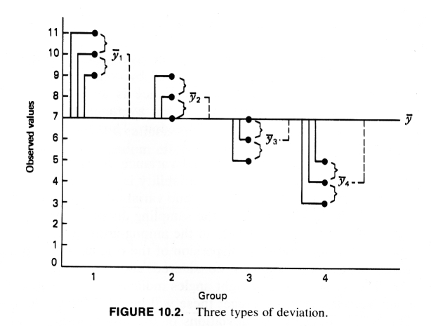
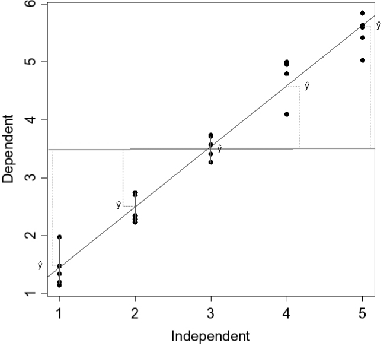
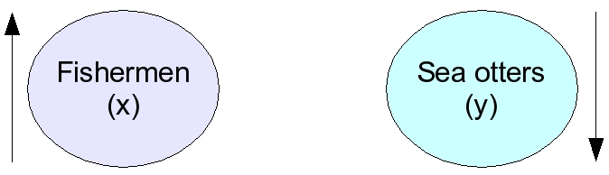
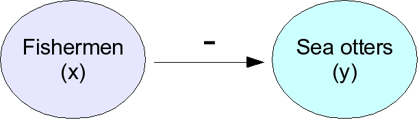
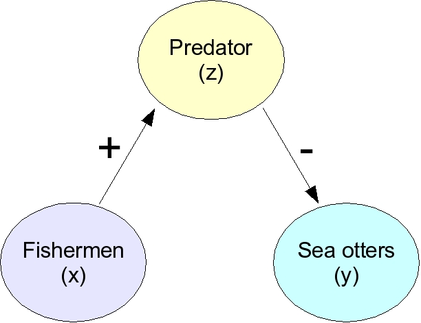
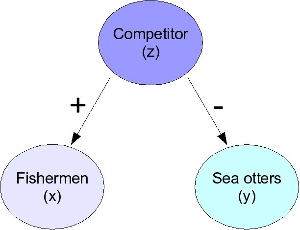



# Extending familiar methods

- Many multivariate methods are extensions of familiar univariate ones
  - ANOVA
  - Regression
  - Correlation
- Reviewing the univariate versions will help understand the multivariate ones

# ANOVA and regression

- Seem distinct, but actually special cases of the same model (Biol 531)

- Based on **partitioning variance** = dividing it into different parts

  - Total variance = raw measure of variation in response variable

  - Explained variation = variation due to the predictor variable

  - Unexplained variation = random variation that the predictor doesn't explain

- Total = Explained + Unexplained

## Partitioning variance {.smaller}

::::: columns
::: {.column width="60%"}
ANOVA

- Explained = differences between group means

- Unexplained = random variation around group means

- Null tested: μ~1~ = μ~2~ = μ~3~ = μ~4~

{fig-align="center" width="264"}
:::

::: {.column width="40%"}
Regression

- Explained = the line

- Unexplained = random variation around the line

- Null tested: β = 0

{fig-align="center" width="272"}
:::
:::::

##  {.centered-bg data-background-iframe="https://wkristan.github.io/apps/regression_anova_apps/reg_anova_apps.html" background-interactive="true" data-external="1"}

## The calculations {.smaller}

:::::::::::: panel-tabset
## Sums of Squares

::::: columns
::: {.column width="50%"}
**ANOVA**

$SS_{total}=\sum(x_i-\bar{\bar{x}})^2$

<br>

$SS_{groups}=n_j\sum(\bar{x_j}-\bar{\bar{x}})^2$

<br>

$SS_{error}=\sum\sum(x_{i,j}-\bar{x_j})^2$
:::

::: {.column width="50%"}
**Regression**

$SS_{total}=\sum(y_i-\bar{y})^2$

<br>

$SS_{regression}=\sum(\hat{y}-\bar{y})^2$

<br>

$SS_{residual}=\sum(y_i-\hat{y})^2$
:::
:::::

## Degrees of Freedom

::::: columns
::: {.column width="50%"}
**ANOVA**

$df_{total}=n-1$

<br>

$df_{groups}=j-1$

<br>

$df_{error}=df_{total}-df_{groups}$
:::

::: {.column width="50%"}
**Regression**

$df_{total}=n-1$

<br>

$df_{regression}=1$

<br>

$df_{residual}=df_{total}-df_{regression}$
:::
:::::

## Mean Squares

::::: columns
::: {.column width="50%"}
**ANOVA**

$MS_{total}=\frac{SS_{total}}{df_{total}}$

<br>

$MS_{groups}=\frac{SS_{groups}}{df_{groups}}$

<br>

$MS_{error}=\frac{SS_{error}}{df_{error}}$
:::

::: {.column width="50%"}
**Regression**

$MS_{total}=\frac{SS_{total}}{df_{total}}$

<br>

$MS_{regression}=\frac{SS_{regression}}{df_{regression}}$

<br>

$MS_{residual}=\frac{SS_{residual}}{df_{residual}}$
:::
:::::
::::::::::::

## New sampling distribution: F

- The t-distribution works well for means

- We now have MS, which are variances

- Our measure of difference will be $\frac{MS_{groups}}{MS_{error}}$, which is the F ratio

- The sampling distribution for ratios of variances is the F distribution

##  {.centered-bg-biggest data-background-iframe="https://wkristan.github.io/apps/sampling_app/fdist_gpt.html" background-interactive="true" data-external="1"}

## Why an F ratio? Expected MS

- Expected mean squares = sources of variation expected to affect each MS estimate

::::: columns
::: {.column width="45%"}
- $\gamma$ = fixed effects of groups
- $\sigma_{error}^2$ = random variation, appears in both
:::

::: {.column width="55%" style="border:1px solid black"}
[$$E(MS_{groups})=\frac{n\sum\gamma^2}{n-1}+\sigma_{error}^2$$]{style="font-size:0.75em"}

<br>

[$$E(MS_{error})=\sigma_{error}^2$$]{style="font-size:0.75em"}
:::
:::::

*If* $\gamma$ = 0 then what is $\frac{MS_{groups}}{MS_{error}}$?

## Post-hocs

- ANOVA prevents excessive false positives by:
  - Conducting an **omnibus** test of significance for the precictor
  - Only if it is significant proceed to compare group means
  - Use procedures that defend against false positives
- Tukey post-hocs compare every combination of group means after a significant ANOVA

## Tukey results

```         
Confidence level used: 0.95 

$contrasts
 contrast          estimate    SE df t.ratio p.value
 groups1 - groups2        2 0.816  8   2.449  0.1442
 groups1 - groups3        4 0.816  8   4.899  0.0052
 groups1 - groups4        6 0.816  8   7.348  0.0004
 groups2 - groups3        2 0.816  8   2.449  0.1442
 groups2 - groups4        4 0.816  8   4.899  0.0052
 groups3 - groups4        2 0.816  8   2.449  0.1442

P value adjustment: tukey method for comparing a family of 4 estimates 
```

## Strength of the relationship

- Statistical significance = probably not random
- If n is large, very small effects can be statistically significant
- The amount of variation explained is a better measure of strength of a relationship
- r^2^ = coefficient of determination

$r^2 = \frac{SS_{groups}}{SS_{total}}$ or $\frac{SS_{regression}}{SS_{residual}}$

## Versatility of ANOVA and regression

- Partition variance to measure effects of:
  - Many different treatment groups
  - Many numeric predictors
  - Mixes of grouping variables and numeric ones
- Multiple response variables → MANOVA

# Correlation

- Measure of association between two variables

::::: columns
::: {.column width="55%"}
- Pearson's r:

  $r=\frac{\sum{(x_i - \bar{x})(y_i - \bar{y})}}{\sqrt{\sum{(x_i - \bar{x})^2 \sum{(y_i-\bar{y})^2}}}}$

- Ranges between -1 and 1

- r = 0 means independent

- No units, no predictor/response
:::

::: {.column width="45%"}
<iframe src="https://wkristan.github.io/apps/correlation/select_corr.html" data-external="1" style="width:375px;height:415px;">

</iframe>
:::
:::::

## Why correlation ≠ causation

- You've probably heard this...but why?
- Causation = change in one variable results in a change in the other
- Correlation is just a consistent association between variables
  - **Not** a chance event
  - Consistent, but not causal
- What can cause consistent associations that are not causal?

## Effects of other variables

- Two variables correlated because both are causally related to a third
  - Birds arriving to breed, start of the plant growing season
  - Gray hair and wrinkled skin
  - Increases in ice cream consumption, increases in crime in the summer
- Example: negative correlation between fishermen and otters

## The basic pattern

*When fishermen increase otters decrease*

{fig-align="center"}

*This could be because...*

## Fishermen kill otters

{fig-align="center"}

*This is a direct, cause and effect process that produces a correlation*

## Fishermen attract predators

{fig-align="center"}

*This is an indirect negative effect of fishermen on sea otters*

## Fishermen target a competitor

{fig-align="center"}

[*Fishing for a competitor → fishermen common where otters are rare*]{style="font-size:0.75em"}

[*No relationship between fishermen and otters, but consistent correlation*]{style="font-size:0.75em"}

## Why correlate? It can be useful

- When there is a cause/effect relationship there will often be a correlation → first step in understanding

- Correlations can be reliable, informative

  - Plant your crops when the birds arrive

  - Clothes sizes

  - Diagnostic aids

# Wrap up - ANOVA and regression

- ANOVA and regression have many similarities
- Both partition variance in data
  - Explainable variation = effect of predictor variable
  - Unexplainable, random variation = variation around line, group means
- Both use a predictor (groups for ANOVA, numeric variable for regression) to explain response
- Both tested with an ANOVA table, F-test

# Wrap up - correlation

- Relative measure of a strength of association between two numeric variables
- Correlations are not coincidences (random associations) - they are consistent associations, but may not be cause/effect
- Unitless, range from -1 to 1
- Correlation of 0 = independence

