

# Characteristics of multivariate data

- Multiple dependent (or **response**) variables

- Dependent variables have some amount of correlation with one another

- Example: Fisher's irises

# Iris flower morphology

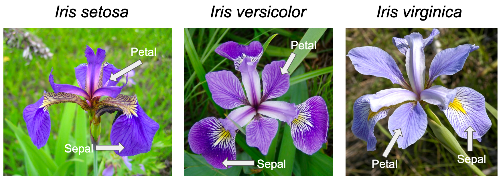{fig-align="center"}

- Measure petal length, width and sepal length, width

# Data organization

::::: columns
::: {.column width="50%"}
- Arranged such that:

  - Rows are observations

  - Columns are variables

- Species is the independent (**predictor**) variable
:::

::: {.column width="50%"}
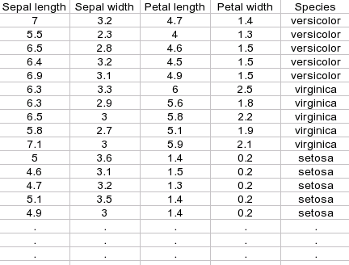{fig-align="center"}
:::
:::::

# Why not stick with single variables?

- [Intrinsically multivariate quantities]{style="color:red"}
- Latent variables, structure
- Coordinated responses
- Multiple testing problems, redundancy

## Intrinsically multivariate

- Flowers are the reproductive organs of plants, function as a unit
- Flowers are complex
  - Made up of many parts (sepals, petals)
  - Can define many variables for each part
- Differences between species can:
  - ...be in the same direction for every variable (size)
  - ...be in different directions (shape)
  - ...only be different for some variables, but not all
- Need several variables to understand differences

## Multivariate flowers

:::::: columns
::: {.column width="30%"}
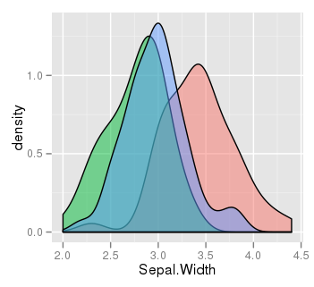{fig-align="center" width="348"} 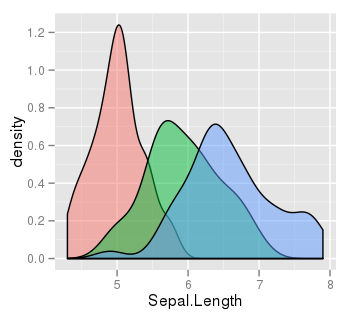{fig-align="center" width="348"}
:::

::: {.column width="40%"}
{fig-align="center"}

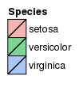{fig-align="center"}
:::

::: {.column width="30%"}
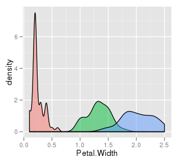{fig-align="center"} 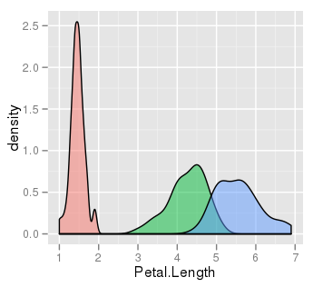{fig-align="center"}
:::
::::::

## Two variables, clearer differences

::::: columns
::: {.column width="60%"}
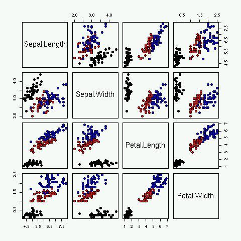{fig-align="center"}
:::

::: {.column width="40%"}
{fig-align="center"}

Separation between *I. versicolor* and *I. virginica* more clear using two variables
:::
:::::

# Why not stick with single variables?

- Intrinsically multivariate quantities
- [Latent variables, structure]{style="color: red"}
- Coordinated responses
- Multiple testing problems, redundancy

## Latent variables

:::::: columns
::: {.column width="60%"}
- Latent = hidden

- Latent variable = exist as a concept, not directly measurable

  - Ex. intelligence, **size**
:::

::: {.column width="40%"}
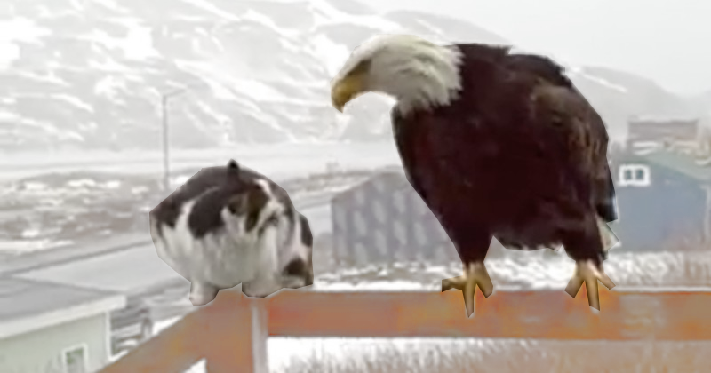{fig-align="center"}
:::

::: {.column width="100%"}
- Indicator variables = variable that is measured, used to construct latent variable

- Requires **structure** in the data

  - Structure = co-variation between variables, positive or negative
:::
::::::

## Another classic data set: Bumpus' sparrows

- Herman Bumpus' found a flock of house sparrows downed by a storm in 1898

  - 72 revived, 64 died

- Recorded several morphological variables:

:::::::: columns
::: {.column width="30%"}
*Total length*

*Alar extent*

*Weight*
:::

::: {.column width="1%"}
:::

::: {.column width="35%"}
*Humerus length*

*Femur length*

*Tibiotarsus length*
:::

::: {.column width="1%"}
:::

::: {.column width="33%"}
*Head length*

*Head width*

*Keel length*
:::
::::::::

## The data

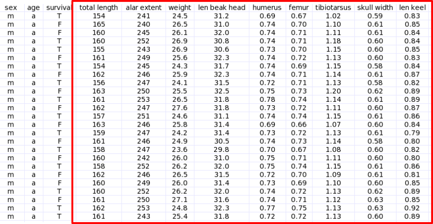{fig-align="center"}

## 

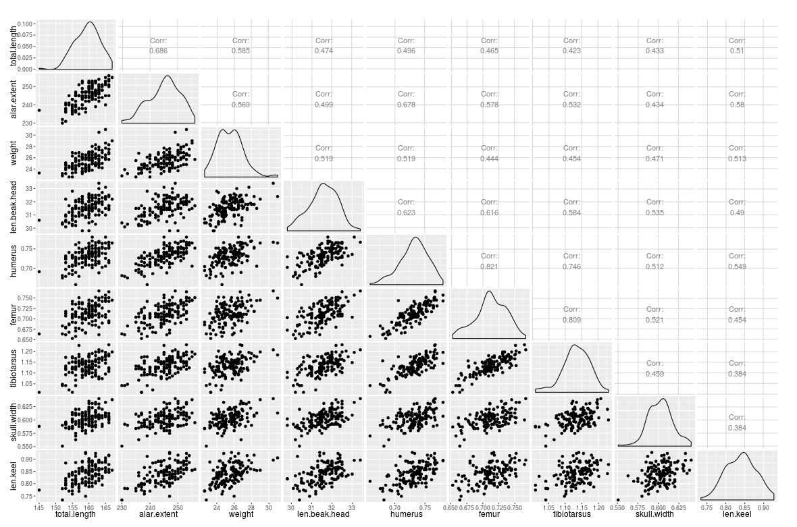{fig-align="center"}

## Skull size as a latent variable

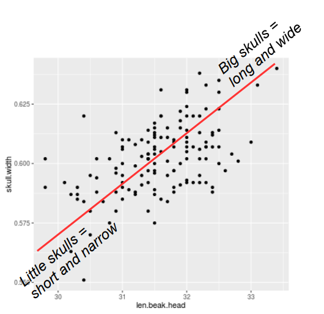{fig-align="center"}

## Body size, leg size

::: {layout-ncol="2"}
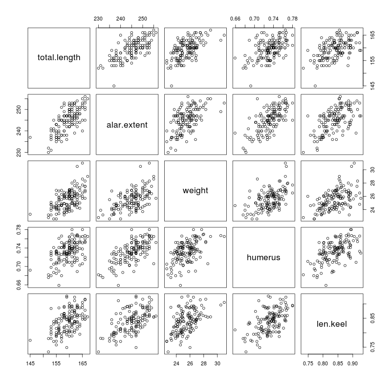{fig-align="center" width="410"}

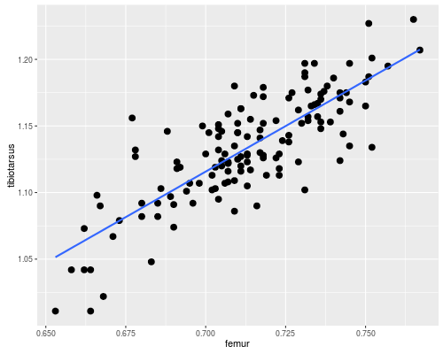{fig-align="center"}
:::

# Why not stick with single variables?

- Intrinsically multivariate quantities
- Latent variables, structure
- [Coordinated responses]{style="color: red"}
- Multiple testing problems, redundancy

## Gene expression

- Microarrays – measure expression of genes across thousands of genes at a time

  - A single array is a single observation

  - Each gene is a variable

- Polygenic responses = affected by many genes

- Genes that change expression together in response to a treatment are likely to all be involved in the response

## Small example

::::: columns
::: {.column width="60%"}
Each spot is a gene

Color indicates expression level

*Green = high, red = low*
:::

::: {.column width="40%"}
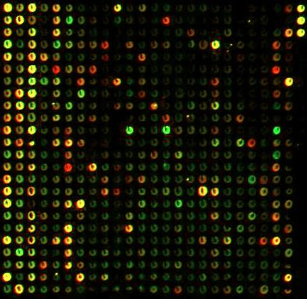
:::
:::::

## Heat map of polygenic responses

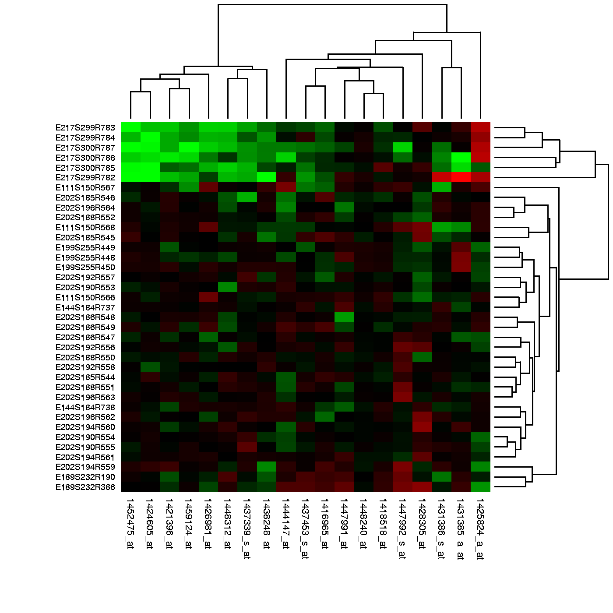{.lightbox fig-align="center" width="40%"}

[*Genes (rows) expressed by samples that were differentially treated (columns)*]{style="font-size:0.75em"}

# Why not stick with single variables?

- Intrinsically multivariate quantities
- Latent variables, structure
- Coordinated responses
- [Multiple testing problems, redundancy]{style="color: red"}

## The multiple testing problem

- Remember Tukey post-hocs

  - Each test of a H~0~ at ⍺ = 0.05 has a 5% chance of a false positive

  - Any non-independent comparisons should be corrected

- Multiple variables made on the same individuals are non-independent

## False positive rate gets bad quickly

- One test has a p of 0.05 of a false positive, no false positive is 1-0.05

- Two tests - probability of no false positives is (1-0.05)^2^ , so:

$p(at\ least\ one\ false) = 1 - 0.95^2$

- With k comparisons, one or more false positives:

$p(at\ least\ one\ false) = 1 - 0.95^k$

## Type I error increases with k

```{webr}

k <- seq(1,20)

plot(k, 1-0.95^k, type = "l")
```

## The multivariate analysis solution

- When testing many responses, do a multivariate analysis first
  - Omnibus test - like an ANOVA
- Follow with post-hocs if the multivariate test is significant
  - Post-hocs for each variable
  - Adjust for the number of variables
- We'll learn to do this in the 7^th^ week

# Visualizing multivariate data

- Extremely important! We are very 3D, visual creatures

- Each variable is a dimension

- Need methods for visualizing \>3D

- Need help to overcome limitations of our 3D brains

## Approaches

- Add dimensions to a standard 2D plot

  - Symbol, color, size

  - Faceting

- Make a "3D" plot

- Use a multidimensional plot

## Adding dimensions to a standard plot

- Plotting on paper = 2D

  - x, y axes are all we got naturally

- Characteristics of plot symbols can be used to display additional variables

- Example: Gapminder's graphs (how many variables are displayed?)

##  {.centered-bg data-background-iframe="https://www.gapminder.org/tools/#$chart-type=bubbles&url=v2" background-interactive="true" data-external="1"}

## Faceting, coplots

::::: columns
::: {.column width="50%"}
*Faceting = subsetting the data with respect to a variable*

*Coplots = 2D plots that facet with respect to one or more additional variable*
:::

::: {.column width="50%"}
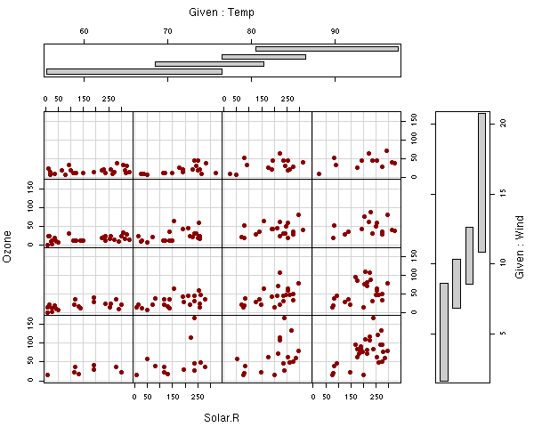{fig-align="center"}
:::
:::::

## 3D graphs {.smaller}

::::: columns
::: {.column width="70%"}
<iframe src="https://wkristan.github.io/apps/scatter3d/3dplots_plotly.html" data-external="1" style="width:100%;height:800px;zoom:0.65">

</iframe>
:::

::: {.column width="30%"}
- Use depth cuing, perspective drawing tricks → appearance of 3D on a 2D surface
- Especially good for scatter plots and surfaces
- **Not** the silly 3D plots in Excel
:::
:::::

## Multidimensional plots

- Plots that are designed to display large numbers of variables
- Some information inevitably lost
  - Quantitative values
  - Distances between data points

:::::::: columns
:::: {.column width="47.5%"}
::: {style="font-size:0.8em"}
*Small n, handful of variables:*

- Chernoff faces

- Segment or star plots
:::
::::

::: {.column width="5%"}
:::

:::: {.column width="47.5%"}
::: {style="font-size:0.8em"}
*Large n, and/or large number of variables:*

- Parallel value plots

- Plots of latend variables
:::
::::
::::::::

## Motor Trends cars data

- 32 cars, variables:

  - MGP, cylinders, displacement, horse power

  - Rear axle ratio, weight, ¼ mile time

  - Cylinder configuration, transmission type

  - Number of forward gears, number of carburetors

- How can we compare cars across all 11 variables at once?

##  {.smaller}

::::: columns
::: {.column width="50%"}
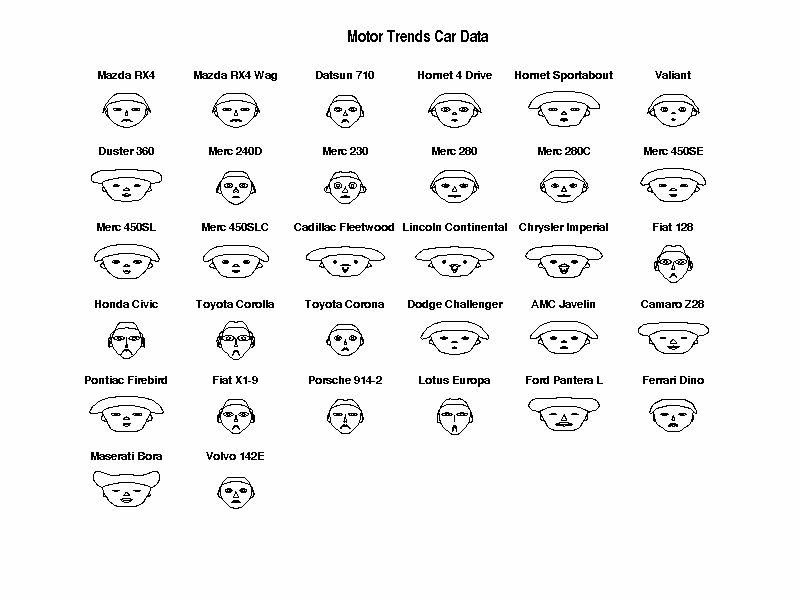{fig-align="center" width="100%"}
:::

::: {.column width="50%"}
*We're good at recognizing, seeing differences between human faces*

*Each face a different data point (car model)*

*Each car variable a facial characteristic:*

*height of face = mpg*

*width of face = cyl*

*shape of face = disp*

*height of mouth = hp*

*width of mouth = drat*

*curve of smile = wt*

*height of eyes = qsec*
:::
:::::

## Segment plot

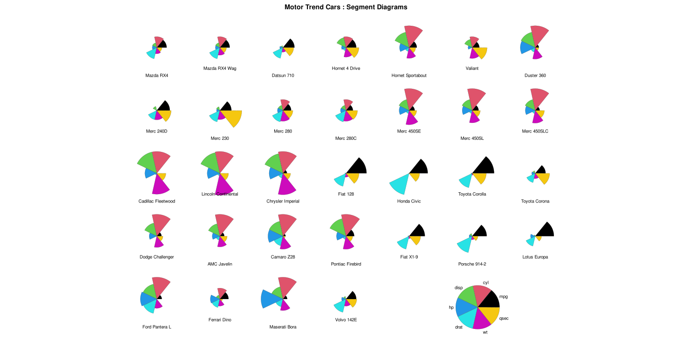{.lightbox fig-align="center" width="90%"}

## Parallel value plots

- Can handle larger sample sizes, more variables

- Each variable gets a vertical line for its axis

- Each observation's variable values are plotted on all of the vertical lines

  - Often standardized = standard deviations from the mean

- Values for each observation connected with lines

## Parallel value plot for iris data

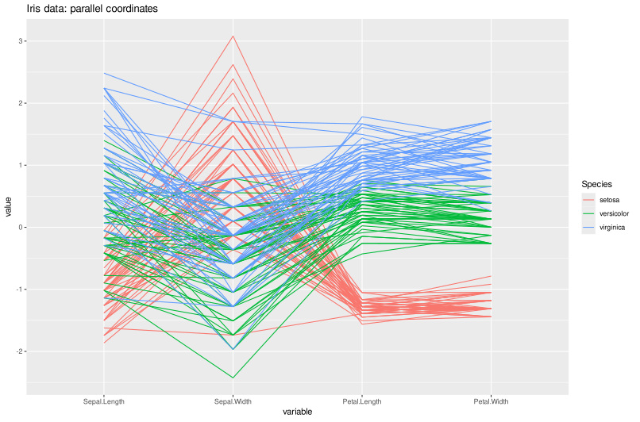{fig-align="center"}

## Radar plots

:::::: columns
::: {.column width="50%"}
- Similar to parallel value, but wrapped

- Variables are spokes on a wheel, connected at center

- Comparing shapes of polygons formed can be easier than parallel value plot
:::

:::: {.column width="50%"}
::: ::::::
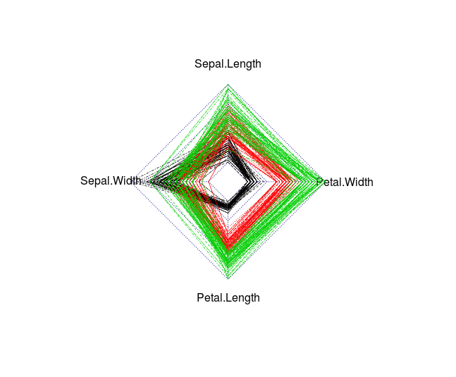
:::
::::
::::::

## Bumpus data as parallel or radar

*Not a lot of difference in male and female morphology*

::::: columns
::: {.column width="50%"}
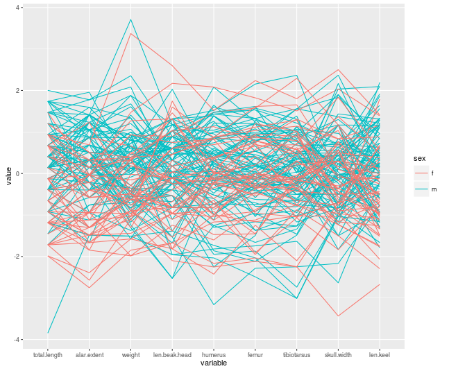{fig-align="center"}
:::

::: {.column width="50%"}
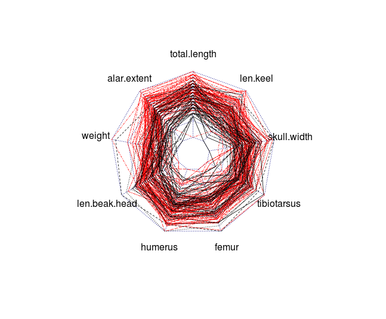{fig-align="center"}
:::
:::::

## Reduced dimensionality plots

- Up to this point, graphs all used raw data

- Other approaches **reduce dimensionality** of data

  - Make latent variables, or

  - Find synthetic variables

  - Graph the **scores** for the latent/synthetic variables instead of the raw data values

- We will learn more in the coming weeks...

# Wrap up

- Many experimental questions are intrinsically multivariate
  - Require more than 1 variable to characterize
- We need special methods to understand them
  - Special analysis methods
  - Special graphical methods
