

# Why does data need screening?

- Important initial step to detect:

  - Distribution issues

  - Data entry errors

  - Missing data

- Accurate results require accurate data (garbage in = garbage out)^-1^

# Missing data is bad

:::::::::::: columns
::: {.column width="70%"}
- Never good, but much worse with multivariate data

- Case dropped if any part is missing

  - Case = multivariate observation *(row of table)*

- Often cases can only be measured once - if botched they are lost forever

[Complete, but smaller, data set →]{.fragment .asides data-fragment-index="5"}
:::

:::::::::: {.column width="30%"}
::::::::: {.r-stack style="font-size:0.5em"}
::: {.fragment .fade-out data-fragment-index="1"}
| mb  | bh  | bl  | nh  |
|:---:|:---:|:---:|:---:|
| 131 | 138 | 89  | 49  |
| 125 | 131 | 92  | 48  |
| 131 | 132 | 99  |     |
| 119 | 132 | 96  | 44  |
| 136 | 143 | 100 | 54  |
|     | 137 | 89  | 56  |
| 139 | 130 | 108 | 48  |
| 125 | 136 | 93  | 48  |
| 131 | 134 | 102 | 51  |
| 134 | 134 | 99  | 51  |
| 129 | 138 |     | 50  |
| 134 | 121 | 95  | 53  |
| 126 | 129 | 109 | 51  |
| 132 |     | 100 | 50  |
| 141 | 140 | 100 | 51  |
:::

::: {.fragment .fade-in-then-out data-fragment-index="1"}
| mb  | bh  | bl  | nh  |
|:---:|:---:|:---:|:---:|
| 131 | 138 | 89  | 49  |
| 125 | 131 | 92  | 48  |
| 131 | 132 | 99  |     |
| 119 | 132 | 96  | 44  |
| 136 | 143 | 100 | 54  |
|     | 137 | 89  | 56  |
| 139 | 130 | 108 | 48  |
| 125 | 136 | 93  | 48  |
| 131 | 134 | 102 | 51  |
| 134 | 134 | 99  | 51  |
| 129 | 138 |     | 50  |
| 134 | 121 | 95  | 53  |
| 126 | 129 | 109 | 51  |
| 132 | 💥  | 100 | 50  |
| 141 | 140 | 100 | 51  |
:::

::: {.fragment .fade-in-then-out data-fragment-index="2"}
| mb  | bh  | bl  | nh  |
|:---:|:---:|:---:|:---:|
| 131 | 138 | 89  | 49  |
| 125 | 131 | 92  | 48  |
| 131 | 132 | 99  |     |
| 119 | 132 | 96  | 44  |
| 136 | 143 | 100 | 54  |
|     | 137 | 89  | 56  |
| 139 | 130 | 108 | 48  |
| 125 | 136 | 93  | 48  |
| 131 | 134 | 102 | 51  |
| 134 | 134 | 99  | 51  |
| 129 | 138 | 💥  | 50  |
| 134 | 121 | 95  | 53  |
| 126 | 129 | 109 | 51  |
| 141 | 140 | 100 | 51  |
:::

::: {.fragment .fade-in-then-out data-fragment-index="3"}
| mb  | bh  | bl  | nh  |
|:---:|:---:|:---:|:---:|
| 131 | 138 | 89  | 49  |
| 125 | 131 | 92  | 48  |
| 131 | 132 | 99  |     |
| 119 | 132 | 96  | 44  |
| 136 | 143 | 100 | 54  |
| 💥  | 137 | 89  | 56  |
| 139 | 130 | 108 | 48  |
| 125 | 136 | 93  | 48  |
| 131 | 134 | 102 | 51  |
| 134 | 134 | 99  | 51  |
| 134 | 121 | 95  | 53  |
| 126 | 129 | 109 | 51  |
| 141 | 140 | 100 | 51  |
:::

::: {.fragment .fade-in-then-out data-fragment-index="4"}
| mb  | bh  | bl  | nh  |
|:---:|:---:|:---:|:---:|
| 131 | 138 | 89  | 49  |
| 125 | 131 | 92  | 48  |
| 131 | 132 | 99  | 💥  |
| 119 | 132 | 96  | 44  |
| 136 | 143 | 100 | 54  |
| 139 | 130 | 108 | 48  |
| 125 | 136 | 93  | 48  |
| 131 | 134 | 102 | 51  |
| 134 | 134 | 99  | 51  |
| 134 | 121 | 95  | 53  |
| 126 | 129 | 109 | 51  |
| 141 | 140 | 100 | 51  |
:::

::: {.fragment .fade-in data-fragment-index="5"}
| mb  | bh  | bl  | nh  |
|:---:|:---:|:---:|:---:|
| 131 | 138 | 89  | 49  |
| 125 | 131 | 92  | 48  |
| 119 | 132 | 96  | 44  |
| 136 | 143 | 100 | 54  |
| 139 | 130 | 108 | 48  |
| 125 | 136 | 93  | 48  |
| 131 | 134 | 102 | 51  |
| 134 | 134 | 99  | 51  |
| 134 | 121 | 95  | 53  |
| 126 | 129 | 109 | 51  |
| 141 | 140 | 100 | 51  |
:::
:::::::::
::::::::::
::::::::::::

## Dealing with missing values: options

::::::::::::::::::: columns
:::::::::: {.column width="70%"}
::::::::: r-stack
::: {.fragment .fade-out data-fragment-index="3"}
- Delete cases, if every variable has some missing
:::

:::: {.fragment .fade-in data-fragment-index="3"}
::: {.fragment .fade-out data-fragment-index="5"}
- Delete variables
  - Since mb has most of the missing values drop it
:::
::::

:::: {.fragment .fade-in data-fragment-index="5"}
::: {.fragment .fade-out data-fragment-index="7"}
- Estimate missing values – options include:
  - Assign the variable average to the missing value
  - Assign predicted values from regression
  - Estimate from structure of data (expectation minimization, multiple imputation)
:::
::::

::: {.fragment .fade-in data-fragment-index="7"}
- None are better than collecting complete observations!
:::
:::::::::
::::::::::

:::::::::: {.column width="30%"}
::::::::: {.r-stack style="font-size:0.5em"}
::: {.fragment .fade-out data-fragment-index="2"}
| mb  | bh  | bl  | nh  |
|:---:|:---:|:---:|:---:|
| 131 | 138 | 89  | 49  |
| 125 | 131 | 92  | 48  |
| 131 | 132 | 99  |     |
| 119 | 132 | 96  | 44  |
| 136 | 143 | 100 | 54  |
|     | 137 | 89  | 56  |
| 139 | 130 | 108 | 48  |
| 125 | 136 | 93  | 48  |
| 131 | 134 | 102 | 51  |
| 134 | 134 | 99  | 51  |
| 129 | 138 |     | 50  |
| 134 | 121 | 95  | 53  |
| 126 | 129 | 109 | 51  |
| 132 |     | 100 | 50  |
| 141 | 140 | 100 | 51  |
:::

::: {.fragment .fade-in-then-out data-fragment-index="2"}
| mb  | bh  | bl  | nh  |
|:---:|:---:|:---:|:---:|
| 131 | 138 | 89  | 49  |
| 125 | 131 | 92  | 48  |
| 119 | 132 | 96  | 44  |
| 136 | 143 | 100 | 54  |
| 139 | 130 | 108 | 48  |
| 125 | 136 | 93  | 48  |
| 131 | 134 | 102 | 51  |
| 134 | 134 | 99  | 51  |
| 134 | 121 | 95  | 53  |
| 126 | 129 | 109 | 51  |
| 141 | 140 | 100 | 51  |
:::

::: {.fragment .fade-in-then-out data-fragment-index="3"}
| mb  | bh  | bl  | nh  |
|:---:|:---:|:---:|:---:|
| 131 | 138 | 89  | 49  |
| 125 | 131 | 92  | 48  |
|     | 132 | 99  | 50  |
| 119 | 132 | 96  | 44  |
| 136 | 143 | 100 | 54  |
|     | 137 | 89  | 56  |
| 139 | 130 | 108 | 48  |
| 125 | 136 | 93  | 48  |
| 131 | 134 | 102 | 51  |
|     | 134 | 99  | 51  |
| 129 | 138 | 95  | 50  |
| 134 | 121 | 95  | 53  |
|     | 129 | 109 | 51  |
| 132 | 136 | 100 | 50  |
| 141 | 140 | 100 | 51  |
:::

::: {.fragment .fade-in-then-out data-fragment-index="4"}
| bh  | bl  | nh  |
|:---:|:---:|:---:|
| 138 | 89  | 49  |
| 131 | 92  | 48  |
| 132 | 99  | 50  |
| 132 | 96  | 44  |
| 143 | 100 | 54  |
| 137 | 89  | 56  |
| 130 | 108 | 48  |
| 136 | 93  | 48  |
| 134 | 102 | 51  |
| 134 | 99  | 51  |
| 138 | 95  | 50  |
| 121 | 95  | 53  |
| 129 | 109 | 51  |
| 136 | 100 | 50  |
| 140 | 100 | 51  |
:::

::: {.fragment .fade-in-then-out data-fragment-index="5"}
| mb  | bh  | bl  | nh  |
|:---:|:---:|:---:|:---:|
| 131 | 138 | 89  | 49  |
| 125 | 131 | 92  | 48  |
| 131 | 132 | 99  |     |
| 119 | 132 | 96  | 44  |
| 136 | 143 | 100 | 54  |
|     | 137 | 89  | 56  |
| 139 | 130 | 108 | 48  |
| 125 | 136 | 93  | 48  |
| 131 | 134 | 102 | 51  |
| 134 | 134 | 99  | 51  |
| 129 | 138 |     | 50  |
| 134 | 121 | 95  | 53  |
| 126 | 129 | 109 | 51  |
| 132 |     | 100 | 50  |
| 141 | 140 | 100 | 51  |
:::

::: {.fragment .fade-in data-fragment-index="6"}
|  mb   |  bh   |  bl  |  nh  |
|:-----:|:-----:|:----:|:----:|
|  131  |  138  |  89  |  49  |
|  125  |  131  |  92  |  48  |
|  131  |  132  |  99  | 50.3 |
|  119  |  132  |  96  |  44  |
|  136  |  143  | 100  |  54  |
| 131.4 |  137  |  89  |  56  |
|  139  |  130  | 108  |  48  |
|  125  |  136  |  93  |  48  |
|  131  |  134  | 102  |  51  |
|  134  |  134  |  99  |  51  |
|  129  |  138  | 97.7 |  50  |
|  134  |  121  |  95  |  53  |
|  126  |  129  | 109  |  51  |
|  132  | 134.1 | 100  |  50  |
|  141  |  140  | 100  |  51  |
:::
:::::::::
::::::::::
:::::::::::::::::::

# Multivariate assumptions

> But first, a little review about statistical assumptions in general ...

## Statistical assumptions

- Assumption = condition required for a procedure to work properly
  - *Not something we take for granted!*
- Two main sources:
  - Sampling requirements
  - Underlying math of the procedure
- How we ensure and/or test for them differs

## Sampling requirements

| We want the sample of data to... | So we need to... |
|:----------------------------------:|:----------------------------------:|
| Accurately represent the population its population | Take random samples from the population |
| Measure response to treatment separately for each observation | Use independent observations |

- These are usually met through good experimental design choices

## Underlying math

| Component of analysis | Assumption |
|:----------------------------------:|:----------------------------------:|
| Estimation of p-value | Normal distributions, equal variances |
| Functional relationship between predictor and response | Linear relationships, differences between groups |

- We test these assumptions
- Also assume data values are recorded accurately, which we can do our best to verify

# Multivariate assumptions

- Multivariate analysis makes the same general sampling assumptions:
  - Random sampling
  - Independent observations
- Extend the usual univariate assumptions to multivariate data:
  - Normality ⟶ multivariate normality
  - HOV ⟶ equality of covariance matrices

##  {.centered-bg data-background-iframe="bivar_normal_pdf/bivar_normal.html" background-interactive="true" data-external="1"}

##  {.centered-bg-bigger data-background-iframe="bivar_normal_pdf/mvnormal_3d.html" background-interactive="true" data-external="1"}

## Start with univariate methods

:::::::: columns
::: {.column width="50%"}
- Why? It's easier, and catches most problems
  - Graphical methods = Q-Q plots, histograms, scatter plots, boxplots
  - Quantitative methods = formal tests of normality, HOV
:::

:::::: {.column width="50%" style="text-align:center"}
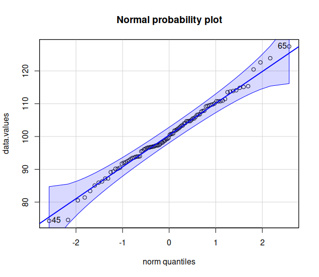{fig-align="center" width="200"}

::::: columns
::: {.column width="40%"}
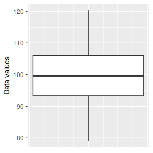{fig-align="center" width="150"}
:::

::: {.column width="40%"}
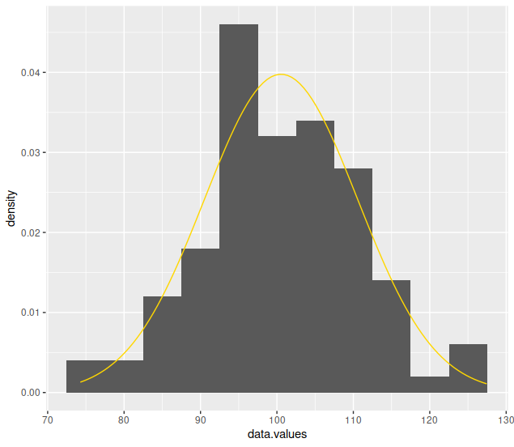{fig-align="center" width="173"}
:::
:::::
::::::
::::::::

## Use residuals for grouped data

::::::::::: columns
::: {.column width="50%"}
- Sepal width differs by species
- Ignoring this makes the data look non-normal
- Residuals = data values - group means
- Using residuals accounts for mean differences
:::

::::::::: {.column width="50%"}
::: {style="text-align:center"}
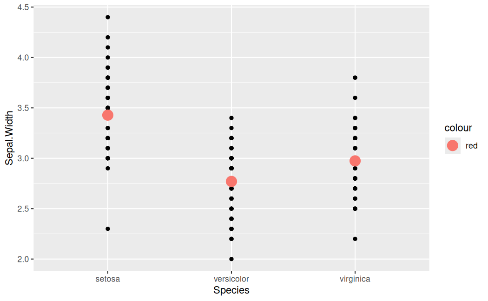{width="350"}
:::

::::::: columns
:::: {.column width="45%"}
::: {style="text-align:center"}
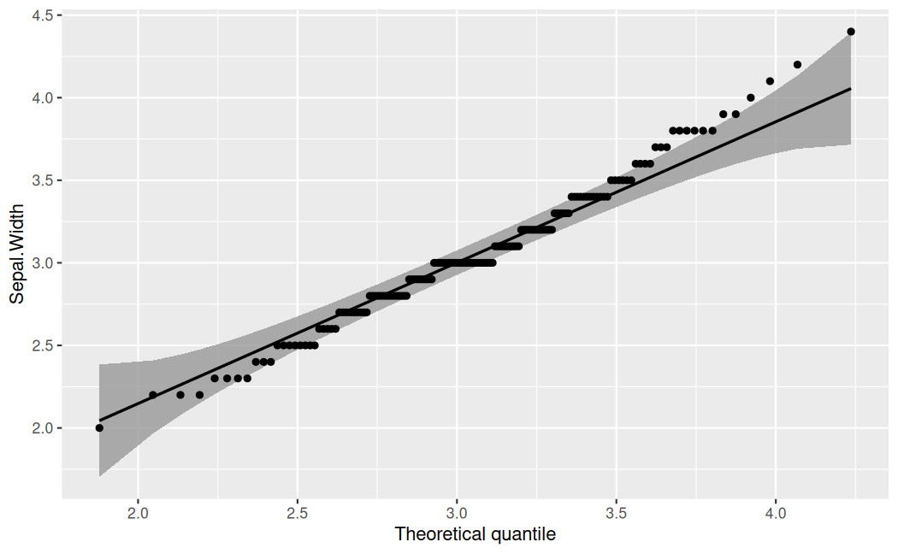{.lightbox width="250"}
:::
::::

:::: {.column width="45%"}
::: {style="text-align:center"}
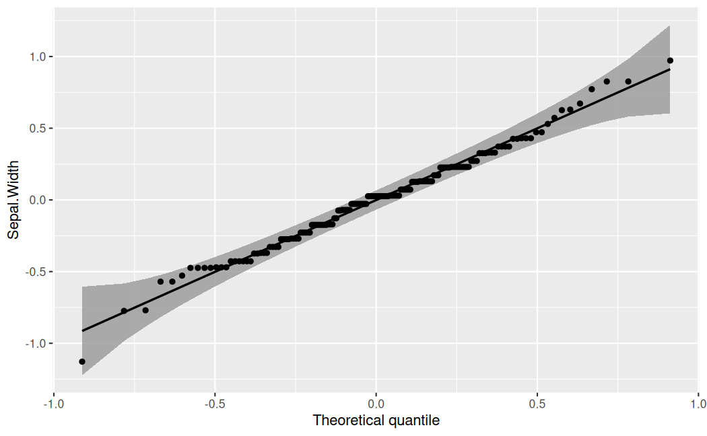{.lightbox width="250"}
:::
::::
:::::::
:::::::::
:::::::::::

## Equal variances

::::: columns
::: {.column width="70%"}
- HOV = variances are the same:

  - Between groups

  - Around regression line

- Multivariate version = equality of covariance matrices

- Fixing non-normality often also fixes lack of HOV (more when we learn MANOVA)
:::

::: {.column width="30%"}
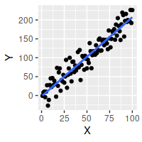{style="border: 4px solid green"}

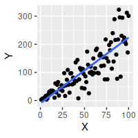{style="border: 4px solid red"}
:::
:::::

##  {style="text-align:center"}

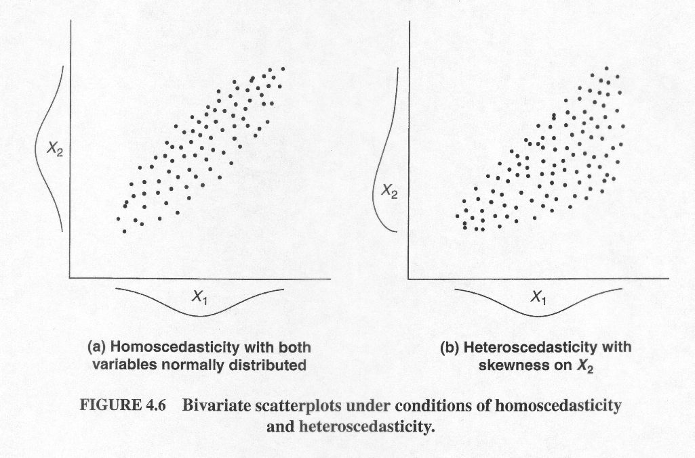{fig-align="center"}

## Linearity

::::: columns
::: {.column width="70%"}
- Most methods will assume linear relationships
- Linear methods applied to non-linear data can be wildly misleading
- Graphical methods best for diagnosis
:::

::: {.column width="30%"}
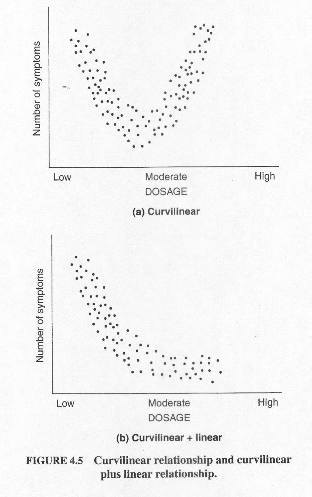{fig-align="center" width="315"}
:::
:::::

## Unusual observations

::::: columns
::: {.column width="50%"}
- Importance: have big effects on results

- Many causes:

  - Errors = data entry errors, data recording errors

  - Non-normal distributions of data (skew, overdispersion ⟶)

  - Design issues = mixing distinct groups together, uncontrolled variables, unmeasured covariates
:::

::: {.column width="50%"}
- Data entry errors *can* cause outliers, but not all outliers are errors

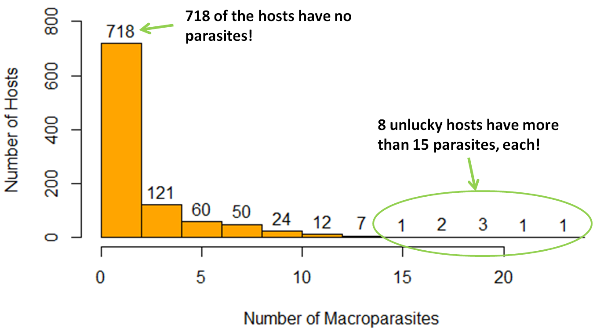{fig-align="center" width="800"}
:::
:::::

# Deviations from multivariate assumptions

- Combinations of variables can be outliers, even if they aren't individually

  - Being 15 years old is not unusual
  - Making \$60k/yr is not unusual
  - A 15 year old making \$60k/yr is unusual

- We can use graphs for bivariate outliers

## 

::: {style="text-align:center"}
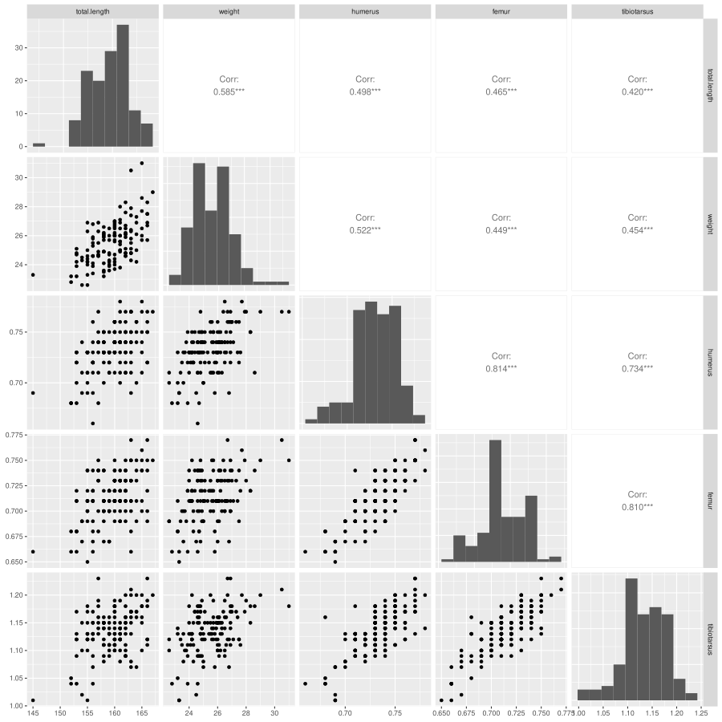{.lightbox fig-align="center" width="500"}
:::

## Beyond two variables

- Graphical methods begin to fail us when we have more than 2 variables
- Need a method of detecting issues with \>2
- Base detection of multivariate deviations on **statistical distance**

## Statistical distance

- One variable = difference between data value and mean:

$$d = x - \bar x$$

- Standardized = expressed in standard deviations

$$ z = \frac{x_i = \bar x}{s}$$

## Distance with two variables

:::::: {style="font-size: 0.5em;"}
::::: columns
::: {.column width="50%"}
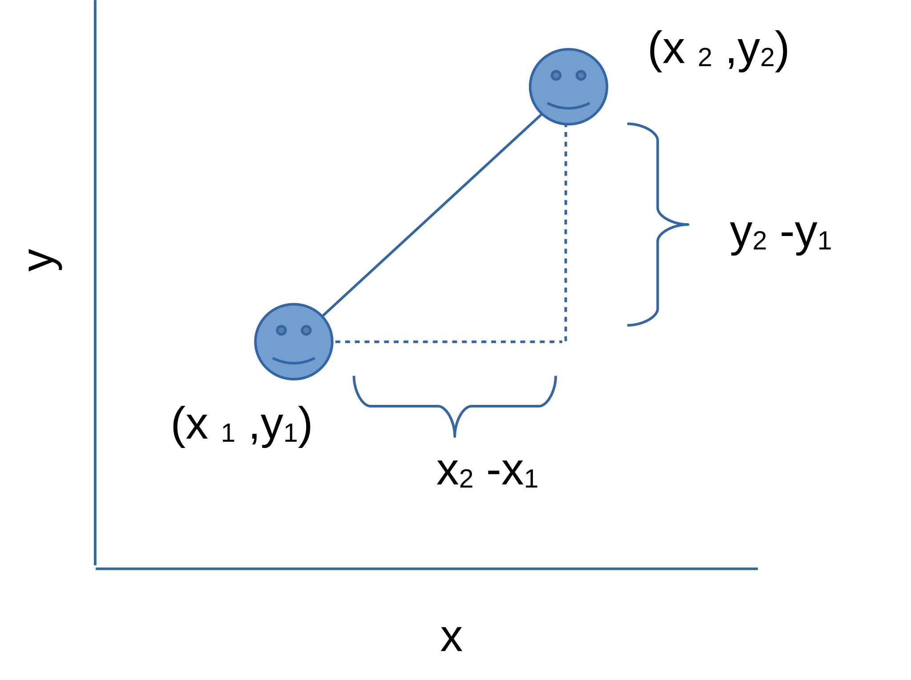{fig-align="center"}

Squared Euclidean distance

$d^2=(x_2-x_1)^2+(y_2-y_1)^2$

Euclidean distance

$d=\sqrt{(x_2 - x_1)^2+(y_2-y_1)^2}$
:::

::: {.column width="50%"}
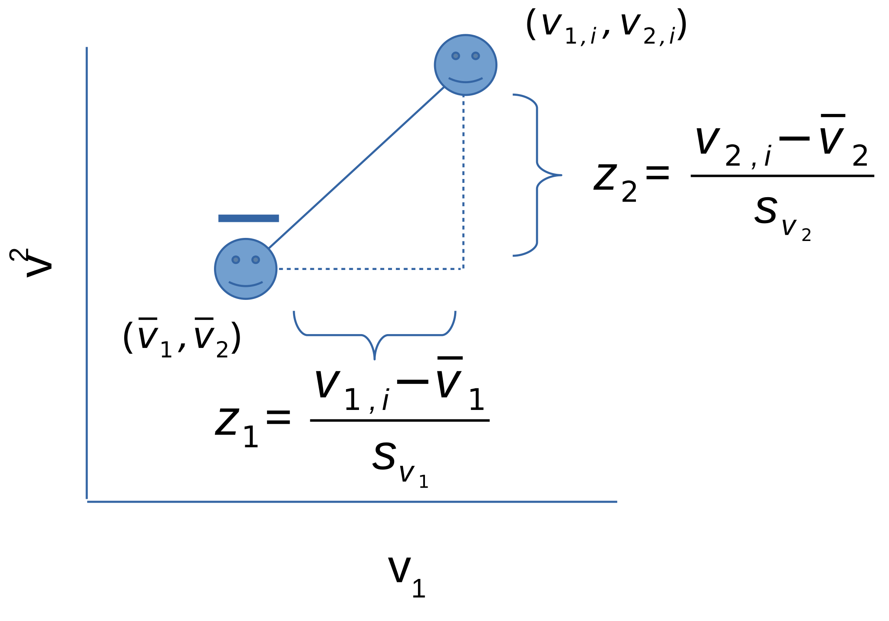{fig-align="center"}

Statistical squared distance

$d^2=\left(\frac{v_{1,i}-\bar{v}_1}{s_1}\right)^2+\left(\frac{v_{2,i}-\bar{v}_2}{s_2}\right)^2=z_1^2+z_2^2$
:::
:::::
::::::

## Accounting for correlation

 

Mahalanobis distance (two variables)

$D^2=\frac{1}{1-r^2}\left[\frac{(v_{1,i}-\bar{v}_1)^2}{s^2_1}+\frac{(v_{2,i}-\bar{v}_2)^2}{s^2_2}-2r\frac{(v_{1,i}-\bar{v}_1)(v_{2,i}-\bar{v}_2)}{{s_1}{s_2}}\right]$

 

*Matrix formula (any number of variables)*

$$D^2=(\textbf{v}-\boldsymbol\mu)'\textbf{S}^{-1}(\textbf{v}-\boldsymbol\mu)$$

##  {.centered-bg-bigger data-background-iframe="https://wkristan.github.io/apps/mahalanobis/mahalanobis.html" background-interactive="true" data-external="1"}

## Causes of big D^2^ values

- Multivariate outliers (combinations)

- Differences in covariance matrices

- Non-linear relationships

- Multivariate non-normality

- Unaccounted-for structure

- Errors (check the data points)

## Graphically screening

Compare the Mahalanobis distances to the 𝛘^2^ distribution

*Iris data, with and without species accounted for*

:::::: {style="text-align:center"}
::::: columns
::: {.column width="50%"}
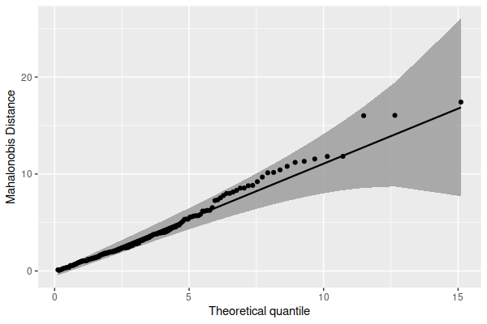{fig-align="center" width="400"}
:::

::: {.column width="50%"}
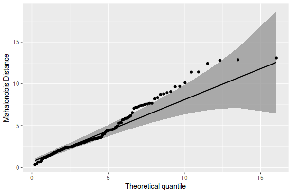{fig-align="center" width="400"}
:::
:::::
::::::

# Fixing problems

- Remove variables - *if weird combinations are causing outliers*

- Add a grouping variable - *if unaccounted-for groupings are causing poor fit*

- Data transformations

- Drop data values if there is external evidence that the measurement it bad!

- Anything you do should be reported in your work

## Transformation

- Good to address distribution issues, non-linear responses

  - Different transformations to different response variables

  - Can include some transformed, some raw

- Transformation changes the analysis

  - Means of log-transformed variables are geometric means

  - Covariance matrices affected

- Iterative - make one change, check assumptions, try another

## Transforming right-skewed variables

:::::: columns
::: {.column width="20%"}
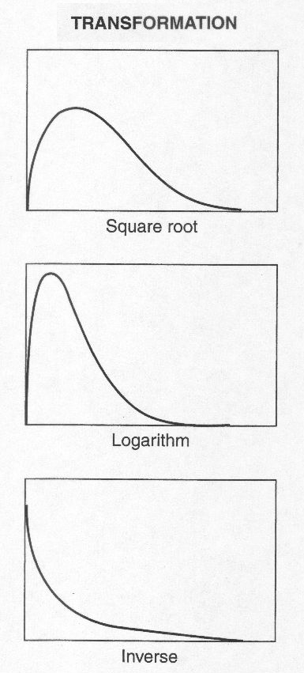{fig-align="center" width="204"}
:::

::: {.column width="60%"}
- Increasingly strong transformation from top to bottom

- Non-linear functions (stretch one tail, compress the other)

- Left-skewed are just the right-skewed after flipping the distribution horizontally
:::

::: {.column width="20%"}
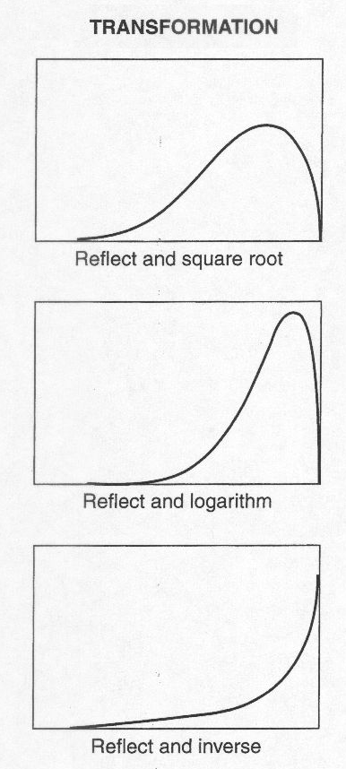{fig-align="center" width="202"}
:::
::::::

# Summary of the process

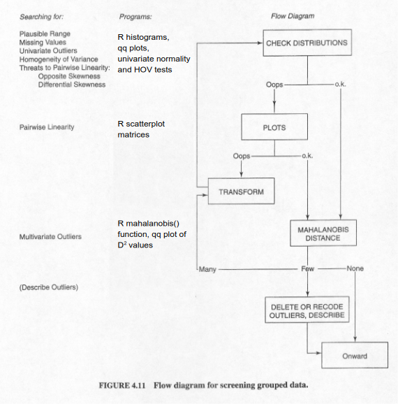{fig-align="center"}
