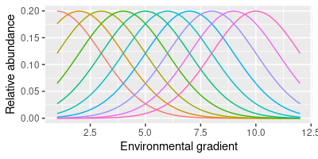

```{r setup, include=FALSE}
knitr::opts_chunk$set(echo = TRUE)
```

## Monitoring diversity

We will be working with data from 11 years of counts of birds at the San Dieguito River estuary, conducted between 2010 and 2020. The counts are done monthly, but I summed the numbers counted each year of each bird species so that we can focus on annual changes.

### The SDRP bird survey data

The data is in file sdrp_waterbirds.xlsx, which you should have downloaded into the project folder for today. There are two worksheets you will use, sdrp_waterbirds and guilds. We need to import both:

library(readxl)
data.frame(read_excel("sdrp_waterbirds.xlsx", sheet = "sdrp_waterbirds")) -> birds
data.frame(read_excel("sdrp_waterbirds.xlsx", sheet = "guilds")) -> guilds

Import the data:

```{r import.data}


```

If you open the birds data you'll see that it has a column for year, and a column with the four letter codes for 75 species of bird detected at the estuary. These are only species that use the estuary habitats, so many species that were counted but are not estuary species were omitted. The four letter codes are standard abbreviations, curated by the American Ornithologist's Union, aside from a few species that are difficult to tell apart in the field and were thus lumped together (Short-billed Dowitcher and Long-billed Dowitcher are lumped as Dowitcher sp. with the column name DOSP, as are Western and Clark's Grebe - WCGR - and Royal and Elegant Tern - ROET).

You can see what species these four letter codes refer to if you open the guilds data - the first two column of this data set is the four letter code and the species common name that it pertains to. The other two columns in guilds shows the species' diet, and its foraging method - we will use the diet information when we assess functional diversity, but will not use the foraging method information today.

### Calculate species diversity

We will stick with the Shannon diversity index as our measure of diversity for this exercise. It is one of the older options, and it incorporates species richness (i.e. how many species are present) and species evenness (i.e. how similar the relative abundances are for the species present).

All of the functions we will need are in the package vegan. If you have not installed it already, switch to the Packages tab, click Install, and install "vegan" (if you're using RStudio through Citrix it should be installed already).

Once vegan is installed you can load it:

library(vegan)

```{r load.vegan}


```

To calculate diversity we just need to use the diversity() function on the columns containing the species. The only column in the birds data set that doesn't have species counts is year, which is first column, so we could use use birds[,-1] to drop the first column with year in it. But, I prefer to make lists of the column names that we want to include, and then use that list of columns to select the data - it is clearer and more self-documenting, and makes trouble shooting commands easier.

To get the list of species, we just need to ask for the names() of the columns in the birds data, but then drop the first one so that only the four letter species codes will be selected:

names(birds)[-1] -> species

```{r get.species.names}


```

You should see an object called species in your environment that has 75 species codes in it.

Now to calculate Shannon diversity we just need to use this species list object to select the columns from birds, and then use those columns in the diversity() function (note that the square brackets have a comma before species - this is needed, as we can enter both the rows we sant to extract and the columns, and leaving the rows position inside the brackets tells R to include every row):

diversity(birds[,species]) -> birds$shannon

```{r diversity}


```

The birds data set now has 78 variables, with the last one being a new column called shannon that contains the Shannon diversity index values for each year. 

Assigning output into a data set object like we just did doesn't produce any output on the screen. To look at the diversity values we just calculated we can extract the year and shannon columns from the birds data set like so:

birds[,c("year","shannon")]

```{r display.diversity}


```

The command birds[,c("year","shannon")] extracts the year and shannon columns from birds and displays them side by side so you can see them. You'll see that there is some variation in diversity each year, but not a clear trend upward or downward. We can graph this using:

library(ggplot2)

ggplot(birds, aes(x = year, y = shannon)) + geom_point() + geom_smooth(method = "lm", se = F)

```{r graph.shannon}


```

It appears that diversity is increasing over time. We can confirm this by running regression analysis on this relationship:

lm(shannon ~ year, data = birds) -> birds.shannon.lm

anova(birds.shannon.lm)

```{r shannon.regression}


```

The increase in diversity over time is (barely!) statistically significant.

Since the Shannon index incorporates both species richness and evenness we can add richness and evenness to the birds data to see which of the two seems to be responsible for the increase in diversity over time. Richness is just a count of non-zero species each year, which vegan produces with the specnumber() function:

specnumber(birds[,species]) -> birds$richness

```{r richness}


```

There is not a built-in function in vegan for evenness, but it can be calcuated from shannon and richness as:

birds$evenness <- birds$shannon/log(birds$richness)

```{r evenness}


```

We can now make graphs of each of these components of the Shannon index - see if you can do this on your own, the command is just like the one you used to graph shannon but with a different y-variable in the aes() argument of ggplot():

```{r plot.diversity}


```

So, interestingly, evenness has been going up, but richness has declined slightly (from 76 to 74) - the increase in diversity has to be due to increased evenness - that is, an increase in the similarity in relative frequencies among the species - rather than an increase in richness, since richness has actually declined over time.

## Functional diversity

Functional diversity refers to the diversity of species that play different ecological roles in the community. A very important functional difference between species is their diet - what a species eats affects how it interacts with other species and what kind of habitat it uses. As an indicator of ecosystem health, an ecosystem that supports a wide range of different diets is meeting the needs of species with different niche requirements, and certainly a decline in functional diversity could be a sign of trouble.

Groups of species that share functional characteristics are called "guilds", and we will use diet to define guilds for these data. The column "Diet" in the guilds data set gives the diet for each species present in the data set. We will use this information in two different ways: 1) to split the species into their guilds, and assess diversity of species within each guild over time and 2) to sum the abundance of species within each guild, and then calculate the diversity of the guilds themselves over time. We will look at the within-guild diversity first.

First, we can split the guilds data set by diet to get separate lists of species for each diet:

split(guilds, guilds$Diet) -> diets

```{r split.guild.by.diet}


```

If you look at the diets object in the Environment tab you'll see that you now have a "list" (which is a kind of R data set made up of named elements), with a subset of the guilds data for each diet - there is a named element for each diet, with the columns Code, Species, Diet, and Foraging.method in each one. We really only need the species codes within each diet guild as a way of selecting species from the birds data that belong to each guild, so this diets list gives us what we need.

Next, we will make use of a function in R that can apply a command repeatedly to each named element of a list, called sapply(). To get diversity within each guild use:

sapply(diets, FUN = function(x) diversity(birds[,x$Code])) -> within.diet.shannon

within.diet.shannon

```{r diversity.within.guild}


```

What just happened? The sapply() function works like so:

- The first argument (diets) is a list with named elements. sapply() extracts one at a time and feeds each to the function defined by FUN =. Since the named elements have the lists of species in each diet guild, we will make use of the Code variable to extract the birds that are in each guild, and then apply a function to them.
- FUN = defines the function to be applied. We want to calculate diversity(), of the birds that are listed in the Code variable. We are defining the function as a function of x, so x takes the place of the named element from diets. That is, the first named element in diets is Carnivore, so the Carnivore data is extracted from diets, given the name x, and fed to the function we define. We want to use the birds identified by the Code column, so using birds[ , x$Code] extracts the species whose four letter codes match those in the Carnivore diet guild, and then uses them to calculate diversity.
- This process is repeated for each of the diets, and then the results are bundled together and returned as a matrix.

To plot this pattern we need to first convert the matrix to a data frame, "stack" the columns, name the columns in the stacked data, and add the year back to the final data set. Stacking means that we want to have a single column for the shannon diversity values, and use another column to indicates the diet guild rather than having each guild in a separate column. These steps are done with the following commands:

data.frame(within.diet.shannon) -> within.diet.shannon # Convert the matrix to a data frame

stack(within.diet.shannon) -> within.diet.shannon.stacked # Stack the columns
names(within.diet.shannon.stacked) <- c("shannon","diet") # Name the columns
birds$year -> within.diet.shannon.stacked$year # Add year to the stacked data


```{r stack.guild.diversities}


```

One thing that seems like it shouldn't work but does is to assign the year column from birds to the stacked data set as a variable. If you look at within.diet.shannon.stacked you'll see that there is a column for year that repeats for each guild, but in the birds data set there are only 11 years. As long as the number of rows in within.diet.shannon.stacked is a multiple of the rows in birds R will just use the years repeatedly. Since we stacked columns that had a row for each year this worked perfectly.

When we have the groups identified by a column we can use that column to graph the groups separately. To plot the within-diet guild diversity over time do the following:

ggplot(within.diet.shannon.stacked, aes(x = year, y = shannon, color = diet, group = diet)) + geom_point() + geom_smooth(method = "lm", se = F) + scale_color_brewer(name = "Diet", palette = 'Set1')

```{r plot.diversity.over.time.by.diet}


```

You'll see both that the guilds differ in their diversities (i.e. the lines are at different heights on the graph), and that some guilds are increasing in diversity over time (omnivores, piscivores, and insectivores), while others are flat to decreasing (carnivores, mudflat invertebrate eaters, herbivores, and granivores).

To calculate the diversity of the diet guilds we need to first sum the counts for the species within each guild by year. This will give us total numbers of each of the diet guilds each year, from which we will be able to calculate Shannon diversity. 

We can use sapply() again to calculate the sums of species within each guild. We will wrap the sapply() function inside of the data.frame() function this time so that the output is converted to a data frame in a single command:

data.frame(sapply(diets, FUN = function(x) rowSums(birds[,x$Code]))) -> diet.sums

diet.sums

```{r sum.within.guilds}


```

You'll see that this operation summed all the birds seen in each diet guild. We can now calculate the diversity of the guilds using the diversity() function:

diversity(diet.sums) -> guild.shannon
data.frame(year = birds$year, shannon = guild.shannon) -> guild.diversity

```{r guild.diversity}


```

These two commands first calculated Shannon diversity from the data in diet.sums and assigned them to a vector called guild.diverstity, and then made a data frame from the year column in the birds data set and the guild.diversity vector. We can plot the guild diversity by year using:

ggplot(guild.diversity, aes(x = year, y = shannon)) + geom_point() + geom_smooth(method = "lm", se = F, formula = y ~ poly(x, 2))

```{r guild.diversity.plot}


```

I included a function for the geom_smooth() command this time, because the default for method = "lm" is a straight line, which fits the data poorly. Using y ~ poly(x, 2) fits a 2nd degree polynomial (i.e. a quadritic) to the data, which does a better job of capturing that guild diversity increased and then leveled off or possibly started to decline.

If you stop here don't forget to knit and upload the Word document to complete the assignment.

## Species composition - optional

Diversity is fine as a way of measuring change in a community, but it's possible for diversity to be unchanged as community composition is changing. Composition refers to the set of species that are present - two communities that are made up of completely different species can nevertheless have identical Shannon diversities if they contain the same number of species with the same relative frequencies.

The methods to statistically measure changes in composition are multivariate, meaning they use more than a single response variable. I teach a class in multivariate analysis, and have the time to explain how the methods work. If you're interested in seeing how it is possible to analyze changes in species composition, please proceed.

Just like with diversity, there are various ways to analyze species comoposition. In general, the methods are called ordinations, in that they seek to put the species in order relative to their presence in the samples. Conceptually, we are looking for a pattern of species increasing to a peak and decreasing as they respond to their physiological tolerances or habitat preferences along some environmental gradient, like so:



Some methods just look for patterns of change in species composition, but don't try to explain what the gradient is that the species might be responding to - these are indirect gradient analysis methods, in that a gradient is assumed to be responsible for the change but it is not explicitly included in the analysis. Direct gradient analysis methods use one or more variables that predict the change in species composition. We will use a direct gradient analysis method called canonical correspondence analysis (CCA), with year as our "gradient" to see whether composition is changing over time.

We will use the cca() function in vegan. The cca() function operates much like lm(), in that we will use a formula to show which variables are to be related to which, but since this is a multivariate method we will have multiple response variables instead of just one. The command is:

cca(birds[,species] ~ year, data = birds) -> birds.cca

birds.cca

```{r birds.cca}


```

The basic output gives us some information about how much variation in species composition is explained by year. The measure used for variation with multivariate data is called inertia, and you can see that the "Constrained" inertia is 0.05, while the "Total" inertia is 0.25 - the proportion of the total explained by year is thus 0.05/0.25 = 0.2213, or about 22.3%. That's a fair amount, considering how much variability there is in abundance of species. we can confirm that this is statistically significant using an equivalent to an ANOVA:

anova(birds.cca, by = "terms")


```{r anova.cca}


```

This is not a conventional analysis of variance - rather, it is based on a permutation test, which means that vegan randomly shuffles the bird data relative to year (this is called a permutation), conducts a CCA, and then records how much inertia is explained by year when the data data are randomly shuffled. It repeats this process many times, and with enough repetitions it's possible to see whether our observed amount of inertia explained is big compared to what would occur by random chance. With a p-value of 0.001 and 999 random permutations our observed variation explained was bigger than any of the randomly shuffled versions - we would reject the null of no relationship between species composition and year, and can go on to try to understand what the change in composition has been.

With a highly multivariate data set like this, the challenge is in the interpretation of the patterns. There are both graphical and numerical ways of understanding the results. First the graphical.

The classic graph for an ordination plots the scores for species (i.e. columns) and samples (i.e. rows) in the same graph, with an arrow indicating the effect of the predictor variable(s). We only have one predictor, so only the position of species along the x-axis should be interpreted, and the arrow for year will need to lie flat along it. The plot is obtained with:

```{r cca.plot}


```

Since year is pointing to the right the species on the right side of the graph are becoming more common over time, while those on the left are becoming less common. The row labels indicate the individual samples relative to their species composition - you can see that row1 (2010) is the firthest to the left, and as you move to the right you move through the years more or less in order (row11, 2020, is not the furthest to the right, but the high numbers are on the right side of the graph and the low numbers are on the left). The closer together the row labels are right to left (ignoring up and down) the more similar their specie compositions are, and the species that tend to be found within them are the ones closest to them.

Thes biplots are neat, but with 75 species they are a little hard to interpret, and it's difficult to properly disregard the y-axis (if we had two or more predictors we would have additional CCA axes and we could interpret both the x and y positions meaningfully, but the y-axis is a pattern of turnover in species that isn't related to year, so it's not of interest to us here). To understand what CCA1 means in terms of changes in species abundances we can calculate the species abundance with the scores for each year - species that are strongly positively correlated with CCA1 scores are increasing over time while those that are strongly negatively correlated with CCA1 are decreasing over time.

First we can get the CCA1 scores:

scores(birds.cca, display = "wa", choices = 1) -> cca1.scores

```{r birds.cca.scores}


```

The display = "wa" argument selects the scores for the years (wa refers to weighted average of the species, which are used to calculate the scores), and choices = 1 selects only the first CCA axis, CCA1, which is the only one available for this analysis.

We can add the years as a column in cca1.scores to make it easier to correlate the birds to year and CCA1:

data.frame(year = birds$year, cca1.scores)

```{r make.cca1.scores.data.frame}


```

We can then correlate all the species with these scores, and with year so that we can confirm that the correlations with CCA1 reflect changes over time (using View() will open the correlations so that you can see them in a tab - you can then sort on columns to put the CCA1 and year columns in order, and see which species had the highest and lowest correlations with each - you'll need to come back to this tab to continue):

View(cor(birds[,species],cca1.scores))

```{r correlate.species.cca1}


```

You'll see that some species are increasing and others decreasing over time.

That's it! Knit and upload your file to complete the assignment.