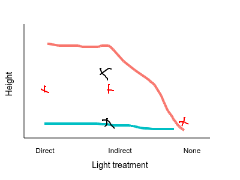

```{r setup, include=FALSE}
knitr::opts_chunk$set(echo = TRUE)
download.file('https://wkristan.github.io/template.docx', 'template.docx', mode = 'wb')
```

## Interactions

Work through the online interaction plot of the rat fat consumption experiment before starting this analysis - it will help you understand what main effects and interactions tell you about your data.

### Check your understanding - what is being tested by a main effect, and what is being tested by an interaction term

Draw the expected results on the graph on the web page - save it to the project folder, and call it "graph.png", and it will appear here:



Refer to this graph to answer the following three questions:

**Question: based on the locations you drew for the marginal means for light levels (pink pluses), do you expect that the main effect of light will be statistically significant? Why or why not?**

> 

**Question: based on the locations you drew for the marginal means for water levels (black xes), do you expect the main effect of water level will be statistically significant? Why or why not?**

> 

**Question: based on the lines connecting means for each combination of water level and light level, do you expect the interaction between light and water to be statistically significant? Why or why not?**

> 

### Analysis of the plant height data set

With the basic patterns in mind, we can start analyzing the data.

Import the data into a data set called plant:

```{r import.data}


```

Summarize the data:

```{r summarize.plant.data}


```

**Question: how can you tell from the summary table that this is a balanced complete design?**

> 


Graph the data:

```{r graph.plant.data}


```

**Question: which combination of light level and water level produces the tallest plants?**

> 

**Question: do you expect to get a statistically significant interaction, based on what you see in this graph? Explain why or why not.**

> 

Run the linear model, get a Type I SS table, and a Type II SS table:

```{r fit.lm}


```

**Question: are the Type I and Type II SS tables different? Should they be? Why or why not?**

> 

## Post-hocs for a model with a significant interaction

We will look at two of the possible approaches.

*Question 1: what is the best combination of light and water?*

For this first approach we will compare means of every combination of light and water level.

Get Tukey post-hocs for the combined levels of light and water, including a compact letter display:

```{r tukey.light.water}


```

**Question: the largest mean height, according to your graph, is for the combination of indirect light and adequate water. Is that combination different from all the others?**

> 

Question 2: at each level of water, which light levels are different?

Instead of comparing every possible combination of light and water we can just focus on differences in light level within each water level category.

Test for differences between light levels, given the water level:

```{r light.given.water.level}


```
**Question: which light levels were different within each of the water level groups?**

> 

Now do the reverse - test for differences in water level, given the light level:

```{r water.given.light.level}


```

**Question: why are there fewer tests when you condition on light level than when you condition on water level?**

> 

**Question: all of the comparisons we generated by conditioning on one of the variables also appears in the Tukey procedure above. Why not just run the Tukey procedure and extract the comparisons we want, instead of doing these conditional tests?**

> 