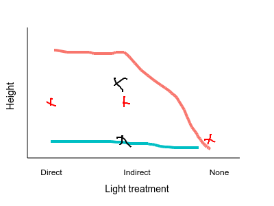

```{r setup, include=FALSE}
knitr::opts_chunk$set(echo = TRUE)
download.file('https://wkristan.github.io/template.docx', 'template.docx', mode = 'wb')
```

## Interactions

Work through the online interaction plot of the rat fat consumption experiment before starting this analysis - it will help you understand what main effects and interactions tell you about your data.

### Check your understanding - what is being tested by a main effect, and what is being tested by an interaction term

Draw the expected results on the graph on the web page - save it to the project folder, and call it "graph.png", and it will appear here:



**Question: based on the locations you drew for the marginal means for light levels (pink pluses), do you expect that the main effect of light will be statistically significant? Why or why not?**

> Yes, because the three red pluses, which are the marginal means for light, are not all the same.

**Question: based on the locations you drew for the marginal means for water levels (black xes), do you expect the main effect of water level will be statistically significant? Why or why not?**

> Yes, because the two black x's, which are the marginal means for water level, are not the same.

**Question: based on the lines connecting means for each combination of water level and light level, do you expect the interaction between light and water to be statistically significant? Why or why not?**

> Yes, because the lines are not parallel, which indicates that the amount of difference between the water levels depends on the light level used.

### Analysis of the plant height data set

With the basic patterns in mind, we can start analyzing the data.

Import the data into a data set called plant:

```{r import.data}

library(readxl)
read_excel("interaction_examples.xls") -> plant

```

Summarize the data:

```{r summarize.plant.data}

library(Rmisc)
plant.sumstats <- summarySE(plant, "height",c("water","light"))

```

**Question: how can you tell from the summary table that this is a balanced complete design?**

> All combinations of light and water are included as a row, and the sample sizes for every combination of light and water are the same.


Graph the data:

```{r graph.plant.data}

library(ggplot2)
ggplot(plant.sumstats, aes(x = light, y = height, color = water, group = water)) +
geom_point() +
geom_errorbar(aes(ymin = height - ci, ymax = height + ci), width = 0.1) +
geom_line()

```

**Question: which combination of light level and water level produces the tallest plants?**

> The biggest mean is for adequate water and indirect light.

**Question: do you expect to get a statistically significant interaction, based on what you see in this graph? Explain why or why not.**

> There should be, because the lines are not parallel.

Run the linear model, get a Type I SS table, and a Type II SS table:

```{r fit.lm}

lm(height ~ light*water, data = plant) -> plant.lm
anova(plant.lm)
library(car)
Anova(plant.lm)

```

**Question: are the Type I and Type II SS tables different? Should they be? Why or why not?**

> The Type I and Type II tables are the same (aside from the order of the columns being different - the numbers are all the same). They should be the same, because our balanced complete design is orthogonal, which means there is no shared variation between light and water that would make the tables differ.

## Post-hocs for a model with a significant interaction

We will look at two of the possible approaches.

*Question 1: what is the best combination of light and water?*

For this first approach we will compare means of every combination of light and water level.

Get Tukey post-hocs for the combined levels of light and water, including a compact letter display:

```{r tukey.light.water}

library(emmeans)
emmeans(plant.lm, tukey ~ light*water) -> plant.emm
plant.emm
multcomp::cld(plant.emm)

```

**Question: the largest mean height, according to your graph, is for the combination of indirect light and adequate water. Is that combination different from all the others?**

> Yes, indirect.adequate has a letter of its own, not shared with any other combination, so it is different from all the other combinations.

Question 2: at each level of water, which light levels are different?

Instead of comparing every possible combination of light and water we can just focus on differences in light level within each water level category.

Test for differences between light levels, given the water level:

```{r light.given.water.level}

emmeans(plant.lm, tukey ~ light | water)

```
**Question: which light levels were different within each of the water level groups?**

> The light levels were all different when adequate water was provided. When adequate water was not provided the light level didn't matter, and none of the means were statistically significantly different.

Now do the reverse - test for differences in water level, given the light level:

```{r water.given.light.level}

emmeans(plant.lm, tukey ~ water | light)

```

**Question: why are there fewer tests when you condition on light level than when you condition on water level?**

> Light has three levels, and there are three possible comparisons with three levels. With two water levels to condition on, there are six total comparisons in the first case. With only two water levels there is only one comparison between water levels possible, and with three light levels to condition on that gives us only three total comparisons.

**Question: all of the comparisons we generated by conditioning on one of the variables also appears in the Tukey procedure above. Why not just run the Tukey procedure and extract the comparisons we want, instead of doing these conditional tests?**

> The Tukey procedure corrects for all of the tests run, so if we were only interested in the six comparisons between light levels at a given water level, or the three comparisons of water levels at given light levels, then producing all 15 Tukey comparisons to get just six or three that we need would correct for many more comparisons than we are actually interested in. We get more powerful comparisons by doing fewer of them.
