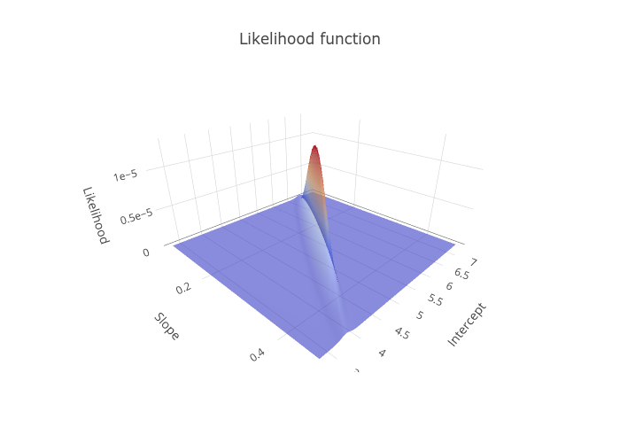

```{r setup, include=FALSE}
knitr::opts_chunk$set(echo = TRUE)
download.file('https://wkristan.github.io/template.docx', 'template.docx', mode = 'wb')

```

## Maximum likelihood estimates of the mean

Work with the online app, and download images into the working folder as instructed. As long as you download the images with the correct file names they will show up in your knitted output. Answer the questions below based on what you find out in the app.

Calculate the likelihood of an estimate of the mean of 119.4, and download the image of the individual likelihoods (name it "mean_119_individual.png") to your project folder, and it will show up below.


#### Question: this estimate of the mean very nearly maximizes the likelihood with respect to one of the data values. Which one?

>

#### Question: for which of these data values is the mean estimate of 119.4 least likely?

>

Download the graph on the right, of the likelihood function for the entire dataset (name it "mean_119_dataset.png"), and it will appear here:


#### Question: why is the likelihood of 119.4 so low for the dataset likelihood function?

>

Now find the maximum likelihood estimate for the mean - slide the slider until the red dot on the dataset likelihood curve is at the peak. Once you have the dot at the peak, download the individual likelihood function graph (call it mean_ml_individual.png).


#### Question: is the maximum likelihood estimate for the mean right at the peak of any of the individual likelihoods? Is it way out in the tails for any of them?

>


Download the dataset likelihood function, and call it mean_ml_dataset.png.


#### Question: Was it necessary for the estimate of 127.8 to maximize the likelihood for any single point to be the maximum likelihood estimate with respect to the entire dataset (why or why not)?

>

#### Question: The likelihood function's maximum is 1.06 x 10^-8^, which is a very small number (0.0000000106). Does this mean that the estimate is not very likely? Explain why the numeric value of the likelihood function isn't interpreted, and is only used in comparison with other likelihoods.

>


Change to the log likelihood, and download the dataset graph here (call it mean_loglike_dataset.png):


#### Question: does putting the likelihoods on a log scale change the location of the maximum?

>

Change to the negative log likelihood, and download the dataset graph here (call it mean_negloglike_dataset.png):


#### Question: to find the maximum likelihood estimate for the mean do you need to maximize the negative log likelihood function or minimize it?

>

#### Question: how is the negative log likelihood different from the log likelihood function? Is the shape, or the location of the maximum likelihood estimate, any different?

>

Now that you know the maximum likelihood estimate of the mean, using your highly non-technical "numerical" method of sliding a slider around until a dot lands on the peak of the likelihood function, let's see how it compares with the analytical formula.

Import the sheet "EstimateMean" from the likelihood_data.xlsx spreadsheet you downloaded to your project folder (put it into an object called "mean.data"):

```{r import.estimate.mean}


```

Calculate the mean of the Data column in mean.data:

```{r calculate.analytical.mean}


```

#### Question: on the app we only had the ability to select estimates for the mean down to one decimal place. To this level of precision, does the maximum likelihood estimate for the mean you got from the web app match the mean you calculated in R?

>

## Likelihood of a linear regression model

Download the graph of the best line you could get by changing the slope and intercept (call it regression_ml.png)


#### Question: what slope and intercept did you use to get this maximum likelihood model? These are the maximum likelihood estimates of the slope and intercept.

>

Download the graph of the likelihood function, and call it like_surface.png.



#### Question: is there still only one maximum for this likelihood function, now that we are using a surface to display it?

>

#### Question: as you were working your way to your maximum likelihood solutions you probably found what seemed like a pretty good estimate for one of the parameters (one that made the regression line thicker or redder), but it became bad when you changed the other one. How does the fact that this likelihood surface is shaped like a shark fin, instead of like a sombrero, explain this?

>

## Likelihood of a regression with a quadratic term

Now find the maximum likelihood model that includes a quadratic term. Download the graph here (call it regression_quad_ml.png).


#### Question: is the likelihood for this quadratic model higher or lower than your simple linear regression model? What does this tell you about which model is better supported by the data?

>

Since models are hypotheses about the structure of the data, we now have two hypotheses to compare. We can compare these hypotheses with a likelihood ratio test.

#### Question: to compare the models we need the log likelihoods for each, and the difference in degrees of freedom for each model. Report the log likelihoods for each model here. What is the difference in degrees of freedom between the models?

>

#### Question: when you enter the log likelihoods into the instruction page you will get a likelihood ratio test comparing them. Report the G statistic, degrees of freedom, and the p-value for the test. Did adding the quadratic term significantly increase the fit of the model to the data?

>

## Using an intercept-only model as a null hypothesis

You can use the likelihood of an intercept-only model to represent the null hypothesis, and compare the log likelihood of the regression model (with both slope and intercept) against the intercept-only model (with only an intercept). Do this in the app in the instructions, and report the results here.

#### Question: report the log likelihood of the intercept-only model, the G statistic, degrees of freedom, and the p-value for the test. Does the slope significantly improve the fit of the model to the data?

>

## Repeat the analysis in R

We can do all of the analyses we did by hand using the apps in the instructions with the lm() functions instead. Import the Regression sheet from likelihood_data.xlsx into a dataset called regression.

```{r import.regression.data}


```

Fit a linear model of y (response) and x (predictor), and put it in an object called linear.lm. Print the linear.lm object so you can see the coefficients (just type the name linear.lm on the line after you fit the model):

```{r linear.regression}


```

#### Question: did the coefficients from lm() match the estimates from the online app (to a decimal place or two)?

>


Get the log likelihood of the linear.lm model:

```{r linear.regression.loglike}


```

#### Question: are the degrees of freedom for the log likelihood the same as for the regression model itself? Where do the degrees of freedom for the log likelihood come from (that is, what are the three parameters that are estimated)? Note that one of the parameters estimated in R was not part of your work in the app, because I estimated it separately to simplify the example (read the explanation in the instructions to see what it is).

>

#### Question: log likelihoods are measures of model fit, like model R^2^. The model R^2^ for this model is 0.5992, which tells us that 59.92% of the variation in y is explained by the model. Does the numeric value of the log likelihood of -11.24 have an interpretable meaning the way that model R^2^ does?

>

Fit a model with both a linear and a quadratic term, and put it into an object called quad.lm. Print the object so you can see the coefficients:

```{r quad.regression}


```

#### Question: do these coefficients match the ones you got from the app (x is the slope, and I(x^2) is the quad term)?

>


Get the log likelihood of the quad.lm model:

```{r quad.regression.loglike}


```

#### Question: why does the quad model have one more degrees of freedom than the linear regression model?

>


Now fit an intercept-only model, store it in an object called intercept.lm, and print it to display the coefficient:

```{r intercept.only}


```

#### Question: is the intercept the same as the mean of the y data?

>

Get the log likelihood for the intercept only model:

```{r int.only.log.likelihood}


```

#### Question: why would we want to fit a model with no predictors? What purpose will it serve?

>


Now to do a likelihood ratio test of each of these models against each other we use lrtest() from the lmtest library, or anova() to compare the three models:

```{r likelihood.ratio.tests}


```

#### Question: which result is closer to the results we got from the app for these comparisons, the version from lrtest() or from anova()?

>

#### Question: likelihood ratio tests have to use the same response data, and have to have nested predictors, meaning that one model has a subset of the predictors in the other model. This was true for both of our comparisons, of linear vs. quadratic regression, and of linear vs. intercept only models. Does this mean that the same estimates for the parameters have to be used? In other words, when you compare the linear regression to the intercept only model both have an intercept term, but did the intercept have to be the same for both models?

>

## Profile likelihood confidence intervals for a proportion

We can profile the likelihood function to obtain confidence intervals for a proportion.

First, find the maximum likelihood estimate of p for a sample of 20 individuals, of which 15 were heterozygote.

#### Question: what is the maximum likelihood estimate for p? Does it match the formula for a proportion, or (number of heterozygotes/total individuals)?

>

#### Question: the confidence interval for the estimate of p of 0.75 is 0.54 to 0.9. The lower limit is 0.21 units from 0.75, and the upper limit is 0.15 units from 0.75. Why is it a good thing for the confidence interval of a proportion to be asymmetrical?

>

Now find the confidence interval for the maximum likelihood estimate of 0.2, with 4 heterozygotes out of 20 individuals.

#### Question: report the 95% confidence limit for p = 0.2 at a sample size of 20. Is this interval also asymmetrical? Which of the two ends (upper or lower) is closer to the estimate?

>

Now, with p = 0.2, but with 100 individuals sampled instead of 20 find the 95% confidence interval.

#### Question: report the 95% confidence limits for p = 0.2 at a sample size of 100. Is the confidence interval narrower than it was with a sample size of 20? Why (be specific - how did the likelihood function change shape, and how does that explain the narrower limits)?

>
